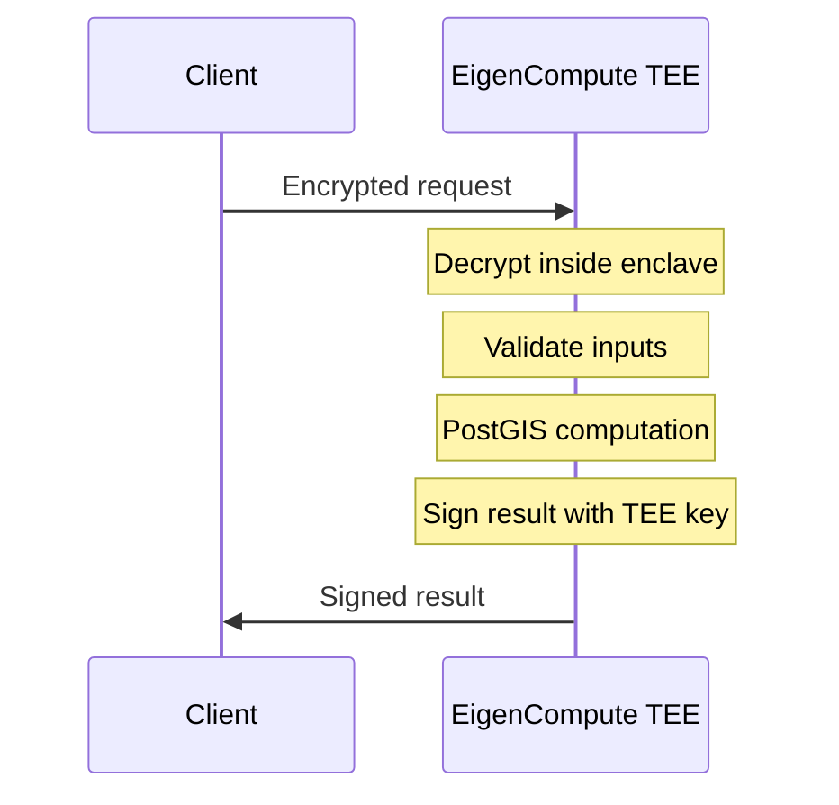

<Note>**Research preview** — APIs may change. [GitHub](https://github.com/AstralProtocol)</Note>

# Astral Location Services

Astral Location Services is the hosted service that performs [location proof verification](/concepts/verify) and [geospatial computation](/concepts/compute). It runs inside a Trusted Execution Environment (TEE), which is what makes the results verifiable rather than merely signed.

## What the Service Provides

Two endpoints, one TEE:

- **[Verify](/concepts/verify)** — Submit a location proof, get back a verified location proof: the original proof, a [credibility vector](/concepts/location-proof-evaluation#the-credibility-vector), and a signed EAS attestation
- **[Compute](/concepts/compute)** — Submit location data with geographic features and a specified spatial operation, get a signed result representing the computed relationship between those features

Both endpoints accept requests via the [Astral SDK](/sdk/overview) or directly through the [API](/api-reference/overview).

## Verifiability Properties

The TEE provides four properties that together make computation verifiable:

| Property | What it guarantees |
|----------|-------------------|
| **Input verification** | Attestation signatures are verified at the TEE boundary. Inputs are validated before computation begins. |
| **Deterministic computation** | Same inputs always produce the same result. PostGIS version is pinned, precision is fixed at centimeter level, and no persistent state exists between requests. |
| **Signed output** | Results are signed by a key that only exists inside the TEE. The key cannot be extracted by the operator. |
| **TEE attestation** | EigenCompute provides hardware-generated attestation that specific code executed on specific inputs inside the enclave. |

Together: the code is attested, the inputs are verified, the computation is deterministic, and the output is signed by a key the operator cannot access. An observer can verify that the result came from the correct code running on the correct inputs — without re-executing the computation.

## Privacy Properties

The TEE provides meaningful privacy guarantees. Inputs and outputs are encrypted in transit and decrypted only inside the enclave — the infrastructure operator never sees raw location data.

- **Raw input coordinates** are processed inside the enclave and never exposed to the operator
- **Exact geometries** (polygon boundaries, line paths) exist only during computation and are discarded after signing
- **The operator** — whoever runs the Astral service — cannot access the plaintext data at any point

The signed result reveals the operation type, the answer, and hashed input references, but not the raw input data itself. Some information leaks from the result (a `contains` answer of `true` tells you the point is inside the polygon), but this is inherent to the computation, not a limitation of the privacy model.

## EigenCompute TEE stack

The service runs on [EigenCompute](https://blog.eigencloud.xyz/eigencloud-brings-verifiable-ai-to-mass-market-with-eigenai-and-eigencompute-launches/), part of the EigenCloud ecosystem:

PostGIS runs **inside** the TEE container, not as an external service — no external dependencies means the entire execution environment is attested. The GEOS library under PostGIS is the same C++ geometry engine used by QGIS, GDAL, and most professional geospatial software.

## The Signing Key

The signing key is generated and provisioned inside the TEE. It cannot be extracted by the operator, even with physical access to the machine. All signed results are produced by this key, and downstream consumers (smart contracts, applications, agents) can verify that a result was signed by the Astral service by checking the signature against the known public key.

<Warning>
  Signing key publication is not yet finalized — key management and rotation are still being worked out for production deployment. This page will be updated with the public key and verification instructions when available.
</Warning>

<Info>
  For key rotation and management details in smart contract integrations, see the [SDK: EAS module](/sdk/eas).
</Info>

## Stateless Model

Each request brings all required inputs. There is no persistent state between requests. This ensures determinism — the same request always produces the same result, regardless of when it's submitted or what other requests have been processed.

## Future Directions

The current TEE-based approach provides verifiable computation today. Future enhancements include:

- **AVS consensus** — Multiple operators independently verify computations
- **ZK proofs** — Cryptographic proof of correct execution without trusted hardware
- **Decentralized signers** — Multi-party result signing

<Card title="Next: Verify" icon="shield-check" href="/concepts/verify">
  The verification endpoint in detail
</Card>

---

**See also:**
- [API Reference](/api-reference/overview) — full endpoint documentation
