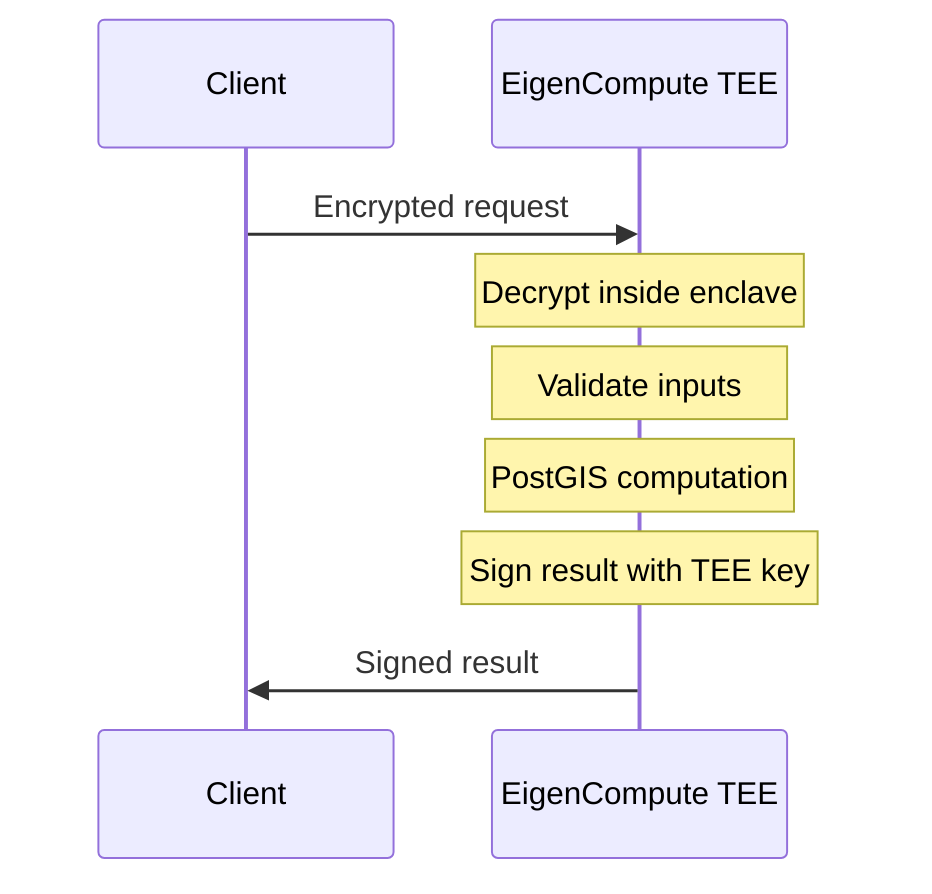

<Note>**Research Preview** — APIs may change. [GitHub](https://github.com/AstralProtocol)</Note>

# Astral Location Services

Astral Location Services is the hosted service that performs [location proof verification](/concepts/verify) and [geospatial computation](/concepts/compute). It is designed to run inside a Trusted Execution Environment (TEE) — which, under attestation, is what makes results verifiable rather than merely signed.

<Warning>
  **Deployment status.** Astral has run this service on real TEE hardware in test deployments, but does not currently fund continuous operation on attested hardware. The properties described below hold when the enclave runs under continuous remote attestation; on the hosted staging service today, a valid signature proves a key Astral controls produced the result, not yet that an independently attested enclave did. See [What you are trusting](/trust-model/what-you-are-trusting). To evaluate against real TEEs, reach out at [contact@astral.global](mailto:contact@astral.global).
</Warning>

<Info>
  The TEE makes the *computation* verifiable — that the attested code ran on the stated inputs. It does not make the *location inputs* truthful. Whether a location is real depends on the strength of the [location proof](/concepts/location-proofs) behind it, not on the TEE.
</Info>

## What the Service Provides

Two endpoints, one TEE:

- **[Verify](/concepts/verify)** — Submit a location proof, get back a verified location proof: the original proof, a [credibility vector](/concepts/location-proof-evaluation#the-credibility-vector), and a signed EAS attestation
- **[Compute](/concepts/compute)** — Submit location data with geographic features and a specified spatial operation, get a signed result representing the computed relationship between those features

Both endpoints accept requests via the [Astral SDK](/sdk/overview) or directly through the [API](/api-reference/overview).

## Verifiability Properties

Under attestation, the TEE is designed to provide four properties that together make computation verifiable:

| Property | What it provides |
|----------|-------------------|
| **Input verification** | Signatures on signed inputs are verified at the TEE boundary, and inputs are validated before computation begins. (Raw GeoJSON carries no signature and is accepted as unverified.) |
| **Deterministic computation** | Same inputs always produce the same result. PostGIS version is pinned, precision is fixed at centimeter level, and no persistent state exists between requests. |
| **Signed output** | Results are signed by a key held inside the TEE, intended to be non-extractable by the operator when the enclave is attested. |
| **TEE attestation** | The TEE is designed to provide hardware-generated attestation that specific code executed on specific inputs inside the enclave (currently via EigenCompute, though the design isn't tied to one provider). |

Together, under attestation: the code is attested, signed inputs are verified, the computation is deterministic, and the output is signed by a key the operator cannot access. An observer can then verify that the result came from the correct code running on the referenced inputs — without re-executing the computation. This is a statement about the *computation*, not about whether the input locations are truthful.

## Privacy Properties

Under attestation, the TEE provides meaningful privacy properties. Inputs and outputs are encrypted in transit and decrypted only inside the enclave, so the infrastructure operator does not see raw location data:

- **Raw input coordinates** are processed inside the enclave and not exposed to the operator
- **Exact geometries** (polygon boundaries, line paths) exist only during computation and are discarded after signing
- **The operator** — whoever runs the Astral service — does not access the plaintext data inside an attested enclave

<Warning>
  **v0 caveat.** Today, signed results may still include input data in plaintext (the full claim, stamps, and credibility vector travel with the result), so anyone who *receives* a result can read those inputs even though the operator does not. A privacy-preserving output mode is planned. See [Privacy](/concepts/privacy) for the full picture.
</Warning>

Some information also leaks from the result itself (a `contains` answer of `true` tells you the point is inside the polygon), but that is inherent to the computation, not a limitation of the privacy model.

## TEE stack

Astral is **not tied to a specific TEE provider**. The architecture is a self-contained Docker container, so in principle it can run in any TEE that supports containerized workloads — assessing portability across providers is ongoing. The current deployment target is [EigenCompute](https://blog.eigencloud.xyz/eigencloud-brings-verifiable-ai-to-mass-market-with-eigenai-and-eigencompute-launches/) (part of the EigenCloud ecosystem):

PostGIS runs **inside** the TEE container, not as an external service — no external dependencies means the entire execution environment is attested. The GEOS library under PostGIS is the same C++ geometry engine used by QGIS, GDAL, and most professional geospatial software.

## The Signing Key

The signing key is generated and provisioned inside the TEE. The design intent is that the operator cannot extract it — a property that holds when the enclave runs under remote attestation (see the deployment-status note above). All signed results are produced by this key, and downstream consumers (smart contracts, applications, agents) can verify that a result was signed by the Astral service by checking the signature against the known public key.

<Warning>
  Signing key publication is not yet finalized — key management and rotation are still being worked out for production deployment. This page will be updated with the public key and verification instructions when available.
</Warning>

<Info>
  For key rotation and management details in smart contract integrations, see the [SDK: EAS module](/sdk/eas).
</Info>

## Stateless Model

Each request brings all required inputs. There is no persistent state between requests. This ensures determinism — the same request always produces the same result, regardless of when it's submitted or what other requests have been processed.

## Future Directions

The current TEE-based approach is what makes computation verifiable under attestation. Directions we're exploring to reduce the trust surface further:

- **AVS consensus** — Multiple operators independently verify computations
- **ZK proofs** — Cryptographic proof of correct execution without trusted hardware
- **Decentralized signers** — Multi-party result signing

<Card title="Next: Verify" icon="shield-check" href="/concepts/verify">
  The verification endpoint in detail
</Card>

---

**See also:**
- [API Reference](/api-reference/overview) — full endpoint documentation
