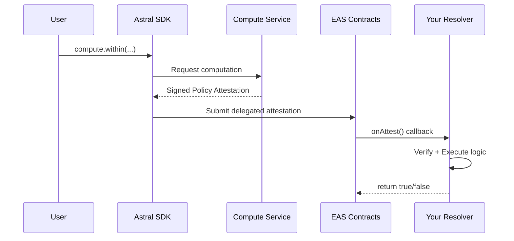

<Warning>
  **Development Preview** — This describes the target specification.
</Warning>

# EAS Resolvers

EAS Resolvers are the **killer feature** for location-based smart contracts. They allow you to execute arbitrary logic whenever an attestation is created — turning location proofs into triggers for onchain actions.

## What is a Resolver?

In the Ethereum Attestation Service, a **resolver** is a smart contract that gets called whenever an attestation is made against a specific schema. This enables:

- **Validation**: Accept or reject attestations based on custom logic
- **Side Effects**: Execute actions atomically with attestation creation
- **Composability**: Combine attestations with any onchain logic

## The Pattern



## Basic Resolver Contract

```solidity
// SPDX-License-Identifier: MIT
pragma solidity ^0.8.0;

import "@eas/contracts/resolver/SchemaResolver.sol";

contract LocationGatedAction is SchemaResolver {
    address public astralSigner;  // Updateable via multisig

    constructor(IEAS eas, address _astralSigner) SchemaResolver(eas) {
        astralSigner = _astralSigner;
    }

    function onAttest(
        Attestation calldata attestation,
        uint256 /* value */
    ) internal override returns (bool) {
        // 1. Verify from Astral
        require(attestation.attester == astralSigner, "Not from Astral");

        // 2. Decode policy result (BooleanPolicyAttestation)
        (
            bool result,
            bytes32[] memory inputRefs,
            uint64 timestamp,
            string memory operation
        ) = abi.decode(
            attestation.data,
            (bool, bytes32[], uint64, string)
        );

        // 3. Execute business logic
        require(result, "Policy check failed");
        _executeAction(attestation.recipient);

        return true;
    }

    function onRevoke(Attestation calldata, uint256)
        internal pure override returns (bool)
    {
        return false;  // Don't allow revocation
    }

    function _executeAction(address recipient) internal virtual {
        // Override in child contracts
    }

    // Multisig-controlled signer update for key rotation
    function updateAstralSigner(address newSigner) external onlyMultisig {
        astralSigner = newSigner;
    }
}
```

## Common Patterns

### NFT Minting

```solidity
contract LocationNFT is LocationGatedAction, ERC721 {
    mapping(address => bool) public hasMinted;
    uint256 public nextTokenId = 1;

    function _executeAction(address recipient) internal override {
        require(!hasMinted[recipient], "Already minted");
        hasMinted[recipient] = true;
        _mint(recipient, nextTokenId++);
    }
}
```

### Token Distribution

```solidity
contract LocationAirdrop is LocationGatedAction {
    IERC20 public token;
    uint256 public amount;

    function _executeAction(address recipient) internal override {
        token.transfer(recipient, amount);
    }
}
```

### Access Control

```solidity
contract LocationGate is LocationGatedAction {
    mapping(address => bool) public hasAccess;

    function _executeAction(address recipient) internal override {
        hasAccess[recipient] = true;
    }

    modifier onlyVerified() {
        require(hasAccess[msg.sender], "Location not verified");
        _;
    }
}
```

## Decoding Attestation Data

### Boolean Policies

```solidity
(
    bool result,
    bytes32[] memory inputRefs,
    uint64 timestamp,
    string memory operation
) = abi.decode(
    attestation.data,
    (bool, bytes32[], uint64, string)
);
```

### Numeric Policies

```solidity
(
    uint256 result,        // Scaled integer (centimeters)
    string memory units,   // "meters" or "square_meters"
    bytes32[] memory inputRefs,
    uint64 timestamp,
    string memory operation
) = abi.decode(
    attestation.data,
    (uint256, string, bytes32[], uint64, string)
);

// Convert back to meters
uint256 meters = result / 100;
```

## Verification Best Practices

<AccordionGroup>
  <Accordion title="Verify Attester" icon="shield-check">
    Always check `attestation.attester == astralSigner`:
    ```solidity
    require(attestation.attester == astralSigner, "Not from Astral");
    ```
  </Accordion>
  <Accordion title="Check Timestamp" icon="clock">
    Prevent replay of old attestations:
    ```solidity
    require(timestamp > block.timestamp - 1 hours, "Attestation too old");
    ```
  </Accordion>
  <Accordion title="Verify Input References" icon="link">
    Ensure the right locations were checked:
    ```solidity
    require(inputRefs[1] == EXPECTED_LANDMARK_UID, "Wrong location");
    ```
  </Accordion>
  <Accordion title="Track Used Attestations" icon="list-check">
    Prevent reuse of attestations:
    ```solidity
    mapping(bytes32 => bool) public usedAttestations;

    function onAttest(...) {
        bytes32 attUid = keccak256(abi.encode(attestation));
        require(!usedAttestations[attUid], "Already used");
        usedAttestations[attUid] = true;
    }
    ```
  </Accordion>
</AccordionGroup>

## Registering Your Schema

```typescript
import { SchemaRegistry } from '@ethereum-attestation-service/eas-sdk';

const schemaRegistry = new SchemaRegistry(SCHEMA_REGISTRY_ADDRESS);

// Boolean policy schema
const boolSchema = "bool result,bytes32[] inputRefs,uint64 timestamp,string operation";

const tx = await schemaRegistry.connect(signer).register({
  schema: boolSchema,
  resolverAddress: yourResolver.address,
  revocable: false
});

const receipt = await tx.wait();
const schemaUID = receipt.logs[0].args.uid;
```

## Key Rotation

Resolver contracts should support updating the Astral signer address:

```solidity
address public multisig;

modifier onlyMultisig() {
    require(msg.sender == multisig, "Not multisig");
    _;
}

function updateAstralSigner(address newSigner) external onlyMultisig {
    emit SignerUpdated(astralSigner, newSigner);
    astralSigner = newSigner;
}
```

<Card title="Next: Verifiable Computation" icon="microchip" href="/concepts/verifiable-computation">
  Learn how EigenCompute provides trust
</Card>
