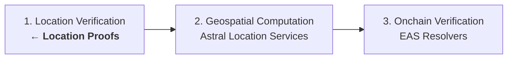
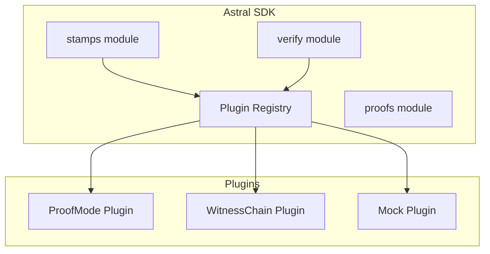

<Warning>
  **Research Preview** — The location proof system is under active development.
</Warning>

# Location proofs

GPS is spoofable. A user can claim to be anywhere in the world, and a smart contract has no way to challenge that claim. Astral's location proof system addresses this by combining evidence from multiple independent proof-of-location sources — device sensors, network measurements, hardware attestation — into a single credibility assessment.

## The evidence problem

Astral Location Services solve the *computation* problem — given location data, we can verifiably check spatial relationships. But computation alone doesn't answer: **was the user actually there?**



Location proofs fill in step 1. They provide *evidence* that a subject was at a claimed location, scored by credibility rather than binary yes/no.

## Terminology

| Term | Definition |
|------|-----------|
| **Claim** | An assertion that a subject was at a location during a time window |
| **Stamp** | Evidence from a single proof-of-location system (one observation) |
| **Proof** | A claim bundled with one or more stamps |
| **Verify** | Check a stamp's internal validity — signatures, structure, signal consistency |
| **Evaluate** | Assess how well a stamp supports a claim — produces a credibility vector |

## How it works

A location proof bundles a **claim** with supporting **stamps**:

```typescript
interface LocationProof {
  claim: LocationClaim;   // "I was at [2.2945, 48.8584] at 14:30"
  stamps: LocationStamp[];  // Evidence from ProofMode, WitnessChain, etc.
}
```

Each stamp carries evidence from a different proof-of-location system — device GPS with sensor data, network latency measurements, hardware attestation results. The verification system evaluates each stamp independently and then analyzes cross-correlation.

### The verification pipeline

<Steps>
  <Step title="Stamp verification">
    Each stamp is checked for internal validity: are the cryptographic signatures correct? Is the data structure well-formed? Are the signals self-consistent?
  </Step>
  <Step title="Claim evaluation">
    Each stamp is evaluated against the claim. How close is the stamp's location to the claimed location? Does the temporal footprint overlap the claimed time window? The result is a **credibility vector** with spatial and temporal scores.
  </Step>
  <Step title="Cross-correlation">
    For multi-stamp proofs, the system analyzes independence (are stamps from different physical phenomena?) and agreement (do they corroborate each other?). Two stamps from different systems that agree are stronger than two from the same system.
  </Step>
  <Step title="Credibility assessment">
    An overall confidence score is computed from individual stamp scores, correlation bonuses, and penalties. A single stamp is capped at 0.85 confidence. Multiple independent stamps can push higher.
  </Step>
</Steps>

## Credibility, not certainty

The confidence score is **not** a calibrated probability. It's a heuristic assessment incorporating:

- Evidence validity (are signatures and structures correct?)
- Claim support (does the evidence match the claim spatially and temporally?)
- Source independence (are stamps from different physical phenomena?)
- Source agreement (do independent stamps corroborate each other?)

A ProofMode stamp with self-reported GPS maxes out around 0.7 for spatial accuracy — the device controls the sensor. A WitnessChain stamp using network latency triangulation provides independent verification from infrastructure the user doesn't control. Together, they're stronger than either alone.

## The plugin architecture

Plugins are the abstraction layer that makes Astral a framework. Each proof-of-location system — ProofMode, WitnessChain, and others in the future — is a plugin that implements a standard interface.



All methods on the plugin interface are optional. A mobile-only plugin might implement `collect`/`create`/`sign` but skip `verify`/`evaluate` (letting the hosted service handle those). A verification-only plugin might implement just `verify`/`evaluate`.

<Card title="Plugin architecture details" icon="puzzle-piece" href="/concepts/plugins">
  How the plugin system works — interface, registry, runtime model
</Card>

## Available plugins

<CardGroup cols={3}>
  <Card title="ProofMode" icon="mobile">
    Device-level evidence: GPS, cell tower, WiFi, hardware attestation. Runs on Android via React Native.
  </Card>
  <Card title="WitnessChain" icon="tower-broadcast">
    Infrastructure-level evidence: network latency triangulation, multi-source IP geolocation. Runs everywhere.
  </Card>
  <Card title="Mock" icon="flask">
    Configurable test plugin with real ECDSA crypto. For development and testing without hardware.
  </Card>
</CardGroup>

## Local vs hosted verification

Plugins implement `verify` and `evaluate` as regular code — you can run them anywhere. The distinction between local and hosted verification is whether you want a TEE attestation on top:

| Mode | What happens | Attestation |
|------|-------------|-------------|
| **Local** | SDK calls plugin's `verify`/`evaluate` directly | None — you trust the plugin code |
| **Hosted** | SDK calls the Astral service, which runs the same plugin code in a TEE | Signed EAS attestation from TEE |

```typescript
// Local verification — runs plugin code in your environment
const result = await astral.verify.stamp(stamp);

// Hosted verification — same logic, but with TEE attestation
const result = await astral.verify.stamp(stamp, { hosted: true });
```

Both paths produce the same credibility assessment. The hosted path adds a signed attestation you can submit onchain.

<CardGroup cols={2}>
  <Card title="Creating location proofs" icon="rocket" href="/guides/creating-location-proofs">
    End-to-end tutorial with the mock plugin
  </Card>
  <Card title="Writing plugins" icon="code" href="/guides/writing-plugins">
    Build a custom proof-of-location plugin
  </Card>
</CardGroup>
