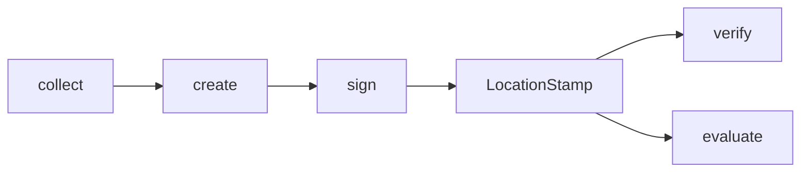

<Warning>
  **Research Preview** — The plugin system is under active development.
</Warning>

# Plugin architecture

Every proof-of-location system is different. ProofMode is a React Native native module that reads device sensors. WitnessChain is an HTTP client that queries a decentralized network. The plugin interface embraces this heterogeneity — one contract, many implementations.

## The plugin interface

```typescript
interface LocationProofPlugin {
  readonly name: string;
  readonly version: string;
  readonly runtimes: Runtime[];
  readonly requiredCapabilities: string[];
  readonly description: string;

  collect?(options?: CollectOptions): Promise<RawSignals>;
  create?(signals: RawSignals): Promise<UnsignedLocationStamp>;
  sign?(stamp: UnsignedLocationStamp, signer: StampSigner): Promise<LocationStamp>;
  verify?(stamp: LocationStamp): Promise<StampVerificationResult>;
  evaluate?(stamp: LocationStamp, claim: LocationClaim): Promise<CredibilityVector>;
}
```

All five methods are optional. Plugins implement what makes sense for their environment and capabilities.

### Method lifecycle



| Method | Purpose | When to implement |
|--------|---------|-------------------|
| `collect` | Gather raw signals from the environment | Plugin has access to sensors, APIs, or hardware |
| `create` | Transform raw signals into an unsigned stamp | Plugin produces stamps (not just verifying existing ones) |
| `sign` | Cryptographically bind the stamp to a signer | Plugin stamps need signatures |
| `verify` | Check a stamp's internal validity | Plugin can validate its own stamp format |
| `evaluate` | Score how well a stamp supports a claim | Plugin can assess spatial/temporal accuracy |

### Runtimes and capabilities

Plugins declare where they can run and what they need:

```typescript
type Runtime = 'react-native' | 'node' | 'browser';
```

| Plugin | Runtimes | Required capabilities |
|--------|----------|----------------------|
| ProofMode | `react-native` | `gps`, `hardware-keystore`, `cell-radio` |
| WitnessChain | `react-native`, `node`, `browser` | `network` |
| Mock | `react-native`, `node`, `browser` | *(none)* |

`runtimes` controls registration — the SDK rejects a plugin that doesn't support the current environment. `requiredCapabilities` is informational, helping developers understand why a plugin is restricted.

## Plugin registry

The SDK manages plugins through a `PluginRegistry` that validates runtime compatibility at registration time:

```typescript
import { AstralSDK } from '@decentralized-geo/astral-sdk';
import { MockPlugin } from '@decentralized-geo/plugin-mock';
import { WitnessChainPlugin } from '@decentralized-geo/plugin-witnesschain';

const astral = new AstralSDK({ chainId: 84532 });

// Register plugins at startup
astral.plugins.register(new MockPlugin());
astral.plugins.register(new WitnessChainPlugin({ proverId: '0x...' }));

// Now use stamps/proofs/verify modules
const signals = await astral.stamps.collect({ plugins: ['mock'] });
```

The registry automatically detects the current runtime (`react-native`, `node`, or `browser`) and throws if you register a plugin that doesn't support it.

```typescript
// This throws in Node.js — ProofMode only runs on React Native
import { ProofModePlugin } from '@decentralized-geo/plugin-proofmode';
astral.plugins.register(new ProofModePlugin()); // Error!
```

### Registry operations

| Method | What it does |
|--------|-------------|
| `register(plugin)` | Add a plugin (validates runtime) |
| `get(name)` | Get a plugin by name (throws if not found) |
| `has(name)` | Check if a plugin is registered |
| `list()` | Get metadata for all plugins |
| `withMethod(method)` | Find plugins that implement a specific method |

## The stamp lifecycle

### 1. Collect raw signals

```typescript
const signals = await astral.stamps.collect({
  plugins: ['proofmode', 'witnesschain'],
  timeout: 10000,
  accuracy: 'high',
});
// Returns RawSignals[] — one per plugin
```

Each plugin gathers observations from its own sources. ProofMode reads device GPS, cell towers, WiFi APs, and hardware attestation. WitnessChain queries its decentralized network for latency-based location challenges.

### 2. Create unsigned stamps

```typescript
const unsigned = await astral.stamps.create(
  { plugin: 'proofmode' },
  signals[0]
);
```

The plugin transforms its raw signals into an `UnsignedLocationStamp` — the standard format with location, temporal footprint, and plugin-specific signal data.

### 3. Sign stamps

```typescript
const stamp = await astral.stamps.sign(
  { plugin: 'proofmode' },
  unsigned,
  mySigner
);
```

The `StampSigner` abstraction lets plugins sign with whatever mechanism is appropriate — a hardware keystore, a software wallet, a PGP key.

### 4. Bundle into a proof

```typescript
const proof = astral.proofs.create(claim, [stamp1, stamp2]);
```

### 5. Verify

```typescript
const assessment = await astral.verify.proof(proof);
console.log(assessment.confidence); // 0.0 to 1.0
```

## Credibility vector

When a plugin evaluates a stamp against a claim, it returns a `CredibilityVector`:

```typescript
interface CredibilityVector {
  supportsClaim: boolean;  // Binary: does evidence support the claim?
  score: number;           // Overall support (0-1)
  spatial: number;         // Spatial accuracy (0-1)
  temporal: number;        // Temporal overlap (0-1)
  details: Record<string, unknown>;  // Plugin-specific details
}
```

This replaces a single confidence number with dimensional scores that the verification system can reason about. A stamp might have high temporal accuracy (it was captured at the right time) but low spatial accuracy (the location is only approximate).

## How the hosted service uses plugins

The Astral hosted service imports plugin packages and runs verify/evaluate inside a TEE. The service adds three things that local verification doesn't provide:

1. **TEE execution** — plugin code runs in a trusted execution environment
2. **Signed attestation** — results are signed by a TEE-held key
3. **EAS integration** — attestation is formatted for onchain submission

The verification logic is the same. The difference is the trust model: local verification trusts your environment, hosted verification trusts the TEE.

<CardGroup cols={2}>
  <Card title="Creating location proofs" icon="rocket" href="/guides/creating-location-proofs">
    Build your first proof with the mock plugin
  </Card>
  <Card title="Writing a plugin" icon="code" href="/guides/writing-plugins">
    Implement the LocationProofPlugin interface
  </Card>
</CardGroup>
