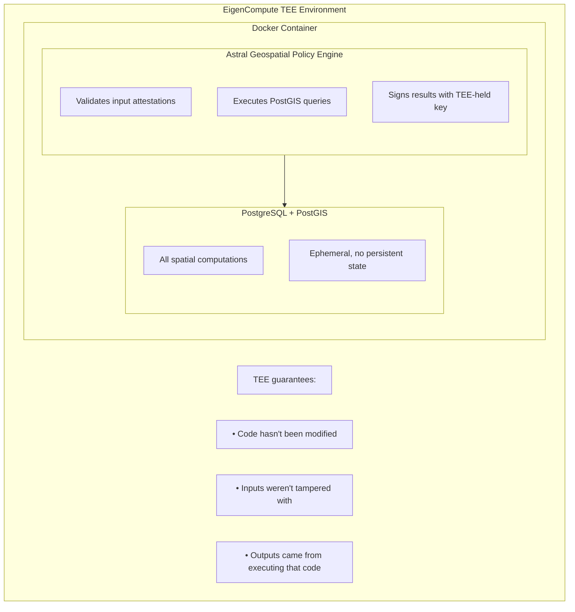

<Warning>
  **Development Preview** — Under active development.
</Warning>

# Verifiable Computation

Astral Location Services runs in a **Trusted Execution Environment (TEE)** via EigenCompute, providing cryptographic guarantees that computations were performed correctly.

## The Verification Pipeline

Building trustworthy location-based smart contracts requires verification at multiple stages:

```
1. Location Verification    →    2. Geospatial Computation    →    3. Onchain Verification
   (Where is the user?)           (Policy evaluation)               (Smart contract logic)
         ???                        ✓ ASTRAL SOLVES THIS                 ✓ EAS Resolvers
```

**Astral Location Services solves the middle step** — verifiable geospatial computation. Given location inputs, we can provably check spatial relationships and produce signed attestations for onchain use.

<Info>
  **What about step 1?** Verifying *where* a user actually is remains an open problem. GPS is spoofable. We're developing the [Location Proof framework](https://collective.flashbots.net/t/towards-stronger-location-proofs/5323) to address this. Location proofs will plug into Astral Location Services to complete the pipeline.
</Info>

## Why Verification Matters

Without verification, you're trusting a black box:

```
User Location → ??? → "Yes, they're nearby"
```

With verifiable computation:

```
User Location → TEE (attested code) → Signed proof of computation
```

The difference is **trust**. Smart contracts can verify that the Astral signing key performed the computation correctly, not just that someone *claims* it did.

## EigenCompute

[EigenCompute](https://blog.eigencloud.xyz/eigencloud-brings-verifiable-ai-to-mass-market-with-eigenai-and-eigencompute-launches/) is part of the EigenCloud ecosystem. It provides:

<CardGroup cols={2}>
  <Card title="TEE Execution" icon="microchip">
    Code runs in a hardware-isolated environment that even the operator can't tamper with
  </Card>
  <Card title="Attestation" icon="certificate">
    Hardware-generated proof that specific code executed on specific inputs
  </Card>
  <Card title="Determinism" icon="equals">
    Same inputs always produce same outputs — reproducible and auditable
  </Card>
  <Card title="Future-Proof" icon="road">
    Path to additional verifiability (ZK proofs, AVS consensus)
  </Card>
</CardGroup>

## The Execution Model



<Note>
  Verify EigenCompute details against the [official EigenCompute documentation](https://blog.eigencloud.xyz/eigencloud-brings-verifiable-ai-to-mass-market-with-eigenai-and-eigencompute-launches/). Hardware attestation (remote attestation) specifics may vary.
</Note>

## Verifiability Properties

| Property | How It's Achieved |
|----------|-------------------|
| **Input Integrity** | Attestation signatures verified at TEE boundary before processing |
| **Execution Integrity** | TEE ensures code runs as deployed, can't be modified |
| **Output Authenticity** | Signing key held inside TEE, can't be extracted |
| **Determinism** | Stateless model + fixed precision = same inputs → same outputs |

## The Astral Signing Key

The service holds a signing key **inside** the TEE:

- Key is generated within the TEE or securely provisioned
- Cannot be extracted by the operator
- All Policy Attestations are signed with this key
- Resolver contracts verify `attestation.attester` matches the known Astral signer

```solidity
// In your resolver
require(attestation.attester == ASTRAL_SIGNER, "Not from Astral");
```

## Trust Model

### Current (MVP)

The trust assumption is **not** that Astral operates honestly — it's that the TEE operates correctly:

- **Open source code**: The compute service code is public and auditable
- **TEE execution**: Code runs inside EigenCompute's trusted execution environment
- **Remote attestation**: EigenCompute provides hardware attestation that the expected code is running
- **Deterministic operations**: Same inputs always produce same outputs, enabling verification

```
Trust = TEE boundary + Remote attestation + Open source code
```

You don't need to trust Astral — you need to trust that the TEE is running the published code.

### Future Enhancements

<Steps>
  <Step title="AVS Consensus">
    Multiple independent operators run the computation. Results must match to be accepted. No single operator can lie.
  </Step>
  <Step title="ZK Proofs">
    Cryptographic proof that the computation was correct. Verifiable by anyone without trusting the prover.
  </Step>
  <Step title="Decentralized Signers">
    Multi-party computation for attestation signing. No single party holds the full key.
  </Step>
</Steps>

## Why This Matters

Consider a location-gated NFT. The question is: how do we check "is the user within 500m of the Eiffel Tower?" in a way that smart contracts can trust?

**The computation problem (what Astral solves):**

If we have location data for the user and the Eiffel Tower, how do we verifiably check if they're close enough? Astral runs the geospatial computation in a TEE and produces a signed attestation:

```
Location A + Location B → TEE (PostGIS) → Signed attestation: "distance = 450m"
```

**The input problem (location proofs, still being developed):**

Even with verifiable computation, users can lie about their location. GPS is spoofable. The attestation proves the *computation* was correct, not that the *inputs* were honest.

This is why we're developing the [Location Proof framework](https://collective.flashbots.net/t/towards-stronger-location-proofs/5323) — to provide evidence-based location claims that can feed into Astral Location Services for a fully verifiable pipeline.

<Warning>
  **Be upfront with your users**: Until location proof plugins are integrated, location verification relies on trusting the user's GPS. Astral provides verifiable *computation*, not verifiable *location*.
</Warning>

## What Makes Location Proofs Useful

The value of the [Location Proof framework](https://collective.flashbots.net/t/towards-stronger-location-proofs/5323) is that it connects location claims to onchain actions with sophisticated geospatial policies. Astral Location Services provides that geospatial policy layer.

We've done significant research on location proofs and have good designs. Now we're building the infrastructure (Astral Location Services) so we can test and iterate — starting with simpler location inputs and plugging in better location proof methods as they're developed.

## Determinism Guarantees

To ensure reproducibility:

- **Precision**: Results rounded to centimeter precision before signing
- **Stateless**: No persistent state between requests
- **Fixed algorithms**: PostGIS version pinned in container

```typescript
// Same inputs always produce same outputs
const result1 = await astral.compute.distance(uid1, uid2);
const result2 = await astral.compute.distance(uid1, uid2);

result1.result === result2.result  // Always true
```

<Card title="Back to: How It Works" icon="arrow-left" href="/how-it-works">
  See the full architecture
</Card>
