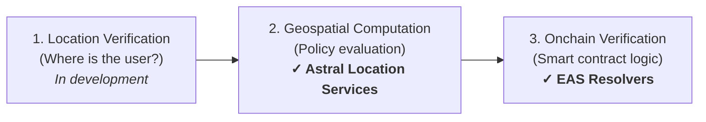
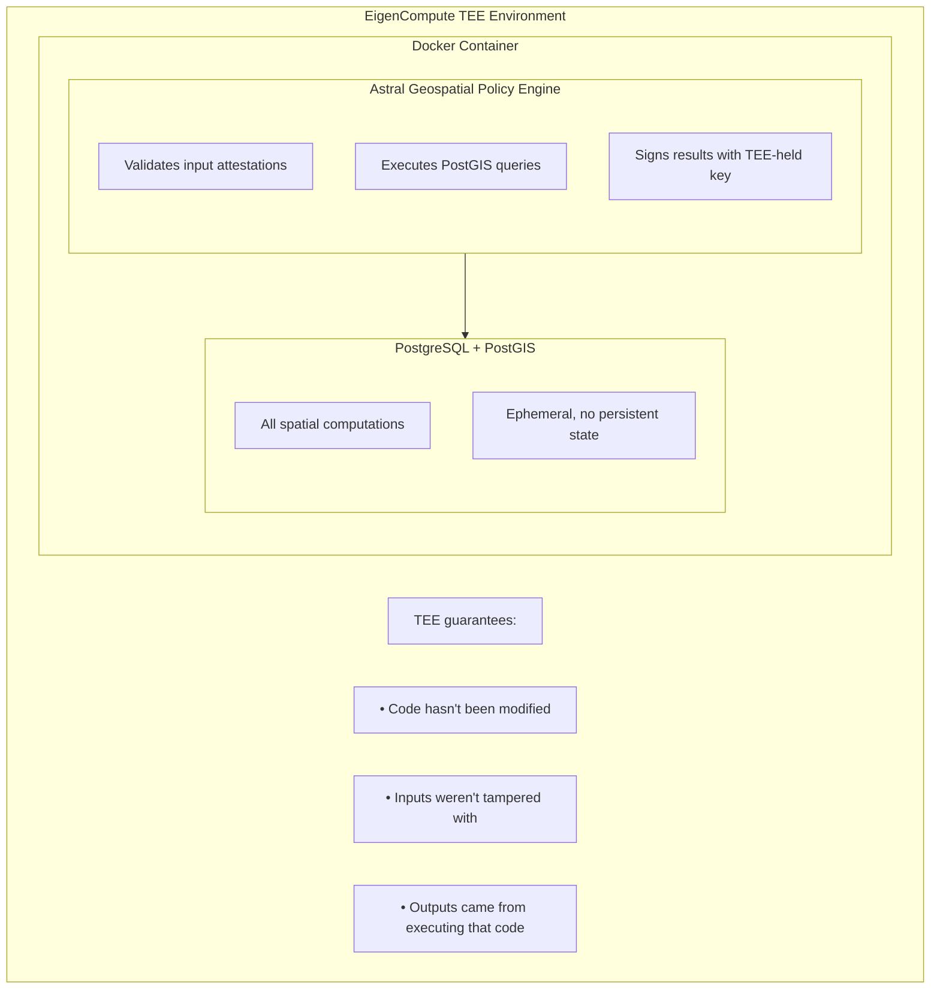

<Warning>
  **Research Preview** — Under active development.
</Warning>

# Verifiable Computation

Astral Location Services run in a **Trusted Execution Environment (TEE)** via EigenCompute, providing cryptographic guarantees that computations were performed correctly.

## The Verification Pipeline

Building trustworthy location-based smart contracts requires verification at multiple stages:


```mermaid
graph LR
    A["1. Location Verification<br/>(Where is the user?)<br/><i>In development</i>"] --> B["2. Geospatial Computation<br/>(Policy evaluation)<br/><b>✓ Astral Location Services</b>"]
    B --> C["3. Onchain Verification<br/>(Smart contract logic)<br/><b>✓ EAS Resolvers</b>"]
```

**Astral Location Services solve the middle step** — verifiable geospatial computation. Given location inputs, we can provably check spatial relationships and produce signed attestations for onchain use.

<Info>
  **What about step 1?** GPS is spoofable. Astral's [location proof system](/concepts/location-proofs) addresses this through a plugin architecture — evidence from device sensors ([ProofMode](/guides/proofmode-integration)), network infrastructure ([WitnessChain](/guides/witnesschain-integration)), and other sources is combined into credibility assessments.
</Info>

## Why Verification Matters

Without verification, you're trusting a black box. Anyone could claim "the user is nearby" without proof.

With verifiable computation, the signed attestation proves the result came from executing specific code on specific inputs inside a TEE. Smart contracts can verify that the Astral signing key performed the computation correctly, not just that someone *claims* it did.

## EigenCompute

[EigenCompute](https://blog.eigencloud.xyz/eigencloud-brings-verifiable-ai-to-mass-market-with-eigenai-and-eigencompute-launches/) is part of the EigenCloud ecosystem. It provides:

<CardGroup cols={2}>
  <Card title="TEE Execution" icon="microchip">
    Code runs in a hardware-isolated environment that even the operator can't tamper with
  </Card>
  <Card title="Attestation" icon="certificate">
    Hardware-generated proof that specific code executed on specific inputs
  </Card>
  <Card title="Determinism" icon="equals">
    Same inputs always produce same outputs — reproducible and auditable
  </Card>
  <Card title="Future-Proof" icon="road">
    Path to additional verifiability (ZK proofs, AVS consensus)
  </Card>
</CardGroup>

## The Execution Model


```mermaid
flowchart TB
    subgraph TEE["EigenCompute TEE Environment"]
        subgraph Container["Docker Container"]
            subgraph Engine["Astral Geospatial Policy Engine"]
                E1["Validates input attestations"]
                E2["Executes PostGIS queries"]
                E3["Signs results with TEE-held key"]
            end
            subgraph DB["PostgreSQL + PostGIS"]
                D1["All spatial computations"]
                D2["Ephemeral, no persistent state"]
            end
            Engine --> DB
        end
        G1["TEE guarantees:"]
        G2["• Code hasn't been modified"]
        G3["• Inputs weren't tampered with"]
        G4["• Outputs came from executing that code"]
    end
```

<Note>
  Verify EigenCompute details against the [official EigenCompute documentation](https://blog.eigencloud.xyz/eigencloud-brings-verifiable-ai-to-mass-market-with-eigenai-and-eigencompute-launches/). Hardware attestation (remote attestation) specifics may vary.
</Note>

## Verifiability Properties

| Property | How It's Achieved |
|----------|-------------------|
| **Input Integrity** | Attestation signatures verified at TEE boundary before processing |
| **Execution Integrity** | TEE ensures code runs as deployed, can't be modified |
| **Output Authenticity** | Signing key held inside TEE, can't be extracted |
| **Determinism** | Stateless model + fixed precision = same inputs → same outputs |

## The Astral Signing Key

The service holds a signing key **inside** the TEE:

- Key is generated within the TEE or securely provisioned
- Cannot be extracted by the operator
- All Policy Attestations are signed with this key
- Resolver contracts verify `attestation.attester` matches the known Astral signer

```solidity
// In your resolver
require(attestation.attester == ASTRAL_SIGNER, "Not from Astral");
```

## Trust Model

### Current (MVP)

Why can you trust the computation results?

- **Open source code**: The compute service code is public and auditable
- **TEE execution**: Code runs inside EigenCompute's trusted execution environment
- **Remote attestation**: EigenCompute provides hardware attestation that the expected code is running
- **Deterministic operations**: Same inputs always produce same outputs (additional testing in progress)

### Future Enhancements

<Steps>
  <Step title="AVS Consensus">
    Multiple independent operators run the computation. Results must match to be accepted. No single operator can lie.
  </Step>
  <Step title="ZK Proofs">
    Cryptographic proof that the computation was correct. Verifiable by anyone without trusting the prover.
  </Step>
  <Step title="Decentralized Signers">
    Multi-party computation for attestation signing. No single party holds the full key.
  </Step>
</Steps>

## Why This Matters

Consider a location-gated NFT. The question is: how do we check "is the user within 500m of the Eiffel Tower?" in a way that smart contracts can trust?

**The computation problem (what Astral Location Services solve):**

If we have location data for the user and the Eiffel Tower, how do we verifiably check if they're close enough? The geospatial policy engine runs the computation in a TEE and produces a signed attestation:

```
Location A + Location B → TEE (PostGIS) → Signed attestation: "distance = 450m"
```

**The input problem (location proofs, still being developed):**

Even with verifiable computation, users can lie about their location. GPS is spoofable. The attestation proves the *computation* was correct, not that the *inputs* were honest.

Astral's [location proof plugins](/concepts/location-proofs) address this by combining evidence from multiple independent proof-of-location systems into credibility assessments. See the [creating location proofs](/guides/creating-location-proofs) guide to get started.

<Warning>
  **Be upfront with your users**: Location proof confidence scores are heuristic assessments, not calibrated probabilities. A single GPS-based stamp is capped at ~0.7 confidence because the device controls the sensor. Multi-source proofs from independent systems provide stronger assurance.
</Warning>

## Why Build the Geospatial Layer First?

Location proofs become useful when they can trigger onchain actions through geospatial policies. Astral Location Services apply those policies — checking if a location is inside a boundary, within range of a target, or satisfies other spatial constraints.

By building the geospatial policy infrastructure now, we can experiment with use cases and iterate as [location proof plugins](/concepts/plugins) mature. New proof-of-location systems plug directly into the existing pipeline through the `LocationProofPlugin` interface.

## Determinism Guarantees

To ensure reproducibility:

- **Precision**: Results rounded to centimeter precision before signing
- **Stateless**: No persistent state between requests
- **Fixed algorithms**: PostGIS version pinned in container

```typescript
// Same inputs always produce same outputs
const result1 = await astral.compute.distance(uid1, uid2);
const result2 = await astral.compute.distance(uid1, uid2);

result1.result === result2.result  // Always true
```

<Card title="Back to: How It Works" icon="arrow-left" href="/how-it-works">
  See the full architecture
</Card>
