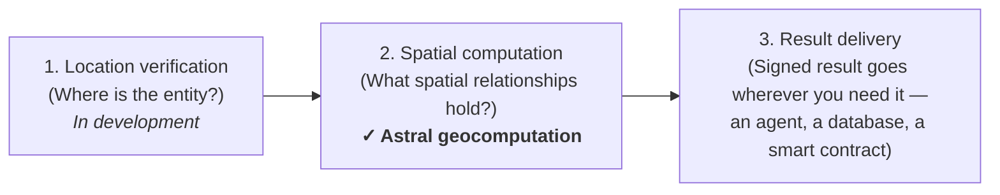

<Note>**Research Preview** — APIs may change. [GitHub](https://github.com/AstralProtocol)</Note>

# Verifiable computation

Astral runs spatial computations inside a Trusted Execution Environment (TEE). The TEE guarantees that computations execute correctly, inputs aren't tampered with, and results are signed by a key that only the TEE holds. This is what makes the results verifiable — not just signed, but provably computed.

## The verification pipeline

Verifiable spatial computation requires verification at multiple stages:


```mermaid
graph LR
    A["1. Location verification<br/>(Where is the entity?)<br/><i>In development</i>"] --> B["2. Spatial computation<br/>(What spatial relationships hold?)<br/><b>✓ Astral geocomputation</b>"]
    B --> C["3. Result delivery<br/>(Signed result goes wherever you need it —<br/>an agent, a database, a smart contract)"]
```

**Astral solves the middle step** — verifiable geocomputation. Given location inputs, the system provably checks spatial relationships and produces signed results.

<Info>
  **What about step 1?** Verifying *where* an entity actually is remains an open problem. GPS is spoofable. We're developing the [Location Proof framework](https://collective.flashbots.net/t/towards-stronger-location-proofs/5323) to address this. Location proofs will plug into Astral to complete the pipeline.
</Info>

## Why verification matters

Without verification, you're trusting a black box. Anyone could claim "the user is nearby" without proof.

With verifiable computation, the signed result proves the output came from executing specific code on specific inputs inside a TEE. Downstream consumers — whether smart contracts, agents, or applications — can verify that the Astral signing key performed the computation correctly, not just that someone *claims* it did.

## EigenCompute

[EigenCompute](https://blog.eigencloud.xyz/eigencloud-brings-verifiable-ai-to-mass-market-with-eigenai-and-eigencompute-launches/) is part of the EigenCloud ecosystem. It provides:

<CardGroup cols={2}>
  <Card title="TEE Execution" icon="microchip">
    Code runs in a hardware-isolated environment that even the operator can't tamper with
  </Card>
  <Card title="Hardware Attestation" icon="certificate">
    Hardware-generated proof that specific code executed on specific inputs
  </Card>
  <Card title="Determinism" icon="equals">
    Same inputs always produce same outputs — reproducible and auditable
  </Card>
  <Card title="Future-Proof" icon="road">
    Path to additional verifiability (ZK proofs, AVS consensus)
  </Card>
</CardGroup>

## Determinism guarantees

To ensure reproducibility:

- **Precision**: Results rounded to centimeter precision before signing
- **Stateless**: No persistent state between requests
- **Fixed algorithms**: PostGIS version pinned in container

```typescript
// Same inputs always produce same outputs
const result1 = await astral.compute.distance(uid1, uid2);
const result2 = await astral.compute.distance(uid1, uid2);

result1.result === result2.result  // Always true
```

## Why build the geocomputation layer first?

Location proofs become useful when they can trigger actions through spatial policies. Astral applies those policies — checking if a location is inside a boundary, within range of a target, or satisfies other spatial constraints.

By building the geocomputation infrastructure now, we can experiment with use cases and iterate while developing the [Location Proof plugins](https://collective.flashbots.net/t/towards-stronger-location-proofs/5323). As proof mechanisms mature, they plug directly into the existing pipeline.

---

For a detailed accounting of what exactly is verified and what trust assumptions remain, see the [Trust Model](/trust-model/architecture).

<Card title="Back to: How It Works" icon="arrow-left" href="/how-it-works">
  See the full architecture
</Card>
