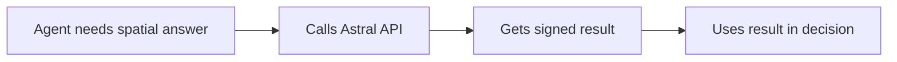

<Note>**Research preview** — APIs may change. [GitHub](https://github.com/AstralProtocol)</Note>

# Agent integration

Autonomous agents need spatial reasoning — is this delivery within the geofence? How far is the nearest facility? Does this route intersect a restricted zone? Astral provides verified spatial answers that agents can use in decision-making.

## The pattern

The integration pattern is straightforward: the agent needs a spatial answer, calls Astral, gets a signed result, and uses the result in its decision logic.



The signed result provides an audit trail. Anyone reviewing the agent's decisions can verify that the spatial reasoning was based on correctly computed data, not fabricated or hallucinated.

## Raw HTTP from any framework

Astral is a REST API, so any language or framework that can make HTTP requests works. No SDK required.

### Python

```python
import httpx

response = httpx.post("https://api.astral.global/compute/distance", json={
    "from": {"type": "Point", "coordinates": [2.2945, 48.8584]},
    "to": {"type": "Point", "coordinates": [2.3522, 48.8566]},
    "chainId": 84532
})

result = response.json()
distance_meters = result["result"]
```

### TypeScript

```typescript
const response = await fetch('https://api.astral.global/compute/distance', {
  method: 'POST',
  headers: { 'Content-Type': 'application/json' },
  body: JSON.stringify({
    from: { type: 'Point', coordinates: [2.2945, 48.8584] },
    to: { type: 'Point', coordinates: [2.3522, 48.8566] },
    chainId: 84532
  })
});

const result = await response.json();
const distanceMeters = result.result;
```

## Using the result in decisions

Once the agent has a signed spatial answer, it can branch on the result:

```python
result = response.json()

if result["result"] < 500:
    # Courier is within 500 meters of the delivery address
    proceed_with_delivery_confirmation(result)
else:
    # Too far — wait or reroute
    schedule_retry(result["result"])
```

For boolean operations like containment or intersection, the result is `true` or `false`:

```python
response = httpx.post("https://api.astral.global/compute/contains", json={
    "container": geofence_polygon,
    "geometry": {"type": "Point", "coordinates": agent_location},
    "chainId": 84532
})

result = response.json()

if result["result"]:
    # Agent is inside the geofence
    execute_geofenced_action()
else:
    # Agent is outside — restricted
    log_boundary_violation()
```

## Example: delivery verification agent

Here is a complete agent workflow that checks whether a courier has arrived at the delivery address. The agent polls the courier's location and confirms delivery when the courier is close enough.

```python
import httpx
import time

ASTRAL_URL = "https://api.astral.global"
DELIVERY_RADIUS_METERS = 100

def check_delivery_proximity(
    courier_coords: list[float],
    destination_coords: list[float],
    chain_id: int = 84532
) -> dict:
    """Check if courier is within delivery radius of destination."""
    response = httpx.post(f"{ASTRAL_URL}/compute/distance", json={
        "from": {"type": "Point", "coordinates": courier_coords},
        "to": {"type": "Point", "coordinates": destination_coords},
        "chainId": chain_id
    })
    response.raise_for_status()
    return response.json()


def delivery_agent(
    courier_coords: list[float],
    destination_coords: list[float]
) -> dict:
    """
    Delivery verification agent.
    Checks proximity and returns a decision with the signed result.
    """
    result = check_delivery_proximity(courier_coords, destination_coords)
    distance = result["result"]

    if distance <= DELIVERY_RADIUS_METERS:
        return {
            "decision": "confirm_delivery",
            "distance_meters": distance,
            "signed_result": result,
            "reason": f"Courier is {distance:.1f}m from destination (within {DELIVERY_RADIUS_METERS}m threshold)"
        }

    return {
        "decision": "wait",
        "distance_meters": distance,
        "signed_result": result,
        "reason": f"Courier is {distance:.1f}m from destination (need to be within {DELIVERY_RADIUS_METERS}m)"
    }


# Run the agent
decision = delivery_agent(
    courier_coords=[2.3522, 48.8566],
    destination_coords=[2.3525, 48.8568]
)

print(f"Decision: {decision['decision']}")
print(f"Reason: {decision['reason']}")
```

The `signed_result` in the decision object contains the full Astral response, including the cryptographic signature. This means the decision is auditable — anyone can verify the spatial computation that led to it.

## Why verified answers matter for agents

When an agent makes a decision based on spatial data, the signed result provides an audit trail. Anyone can verify that the agent's spatial reasoning was based on correctly computed data.

This matters for several reasons:

- **Accountability** — if an agent approves a delivery payout based on location proximity, the signed result proves the distance was computed correctly on the stated inputs.
- **Dispute resolution** — when a decision is challenged, the signed result is independent evidence. It does not depend on trusting the agent's own logs.
- **Composability** — signed results can be submitted onchain to trigger smart contract logic, bridging the agent's offchain reasoning with onchain actions.

Without verified computation, an agent's spatial claims are self-reported. With Astral, they are independently verifiable.

## Next steps

<CardGroup cols={2}>
  <Card title="Calling the API" icon="code" href="/guides/calling-the-api">
    Full details on request format and error handling
  </Card>
  <Card title="Blockchain integration" icon="link-simple" href="/guides/blockchain-integration">
    Submit agent decisions onchain via EAS
  </Card>
</CardGroup>
