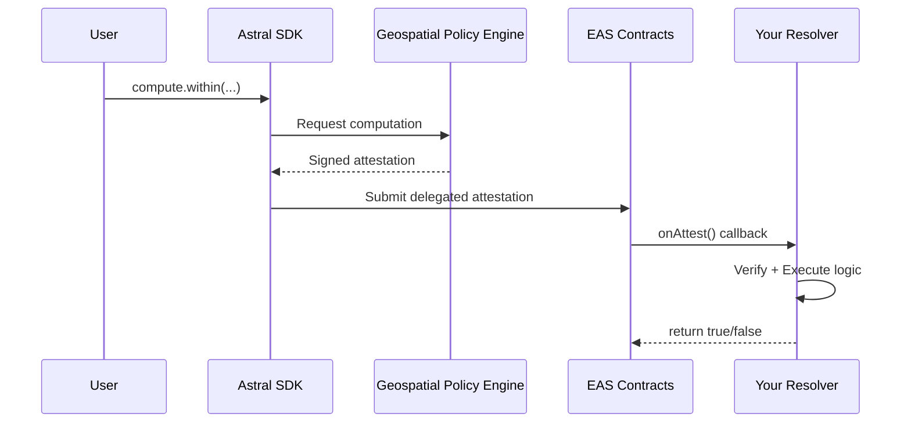
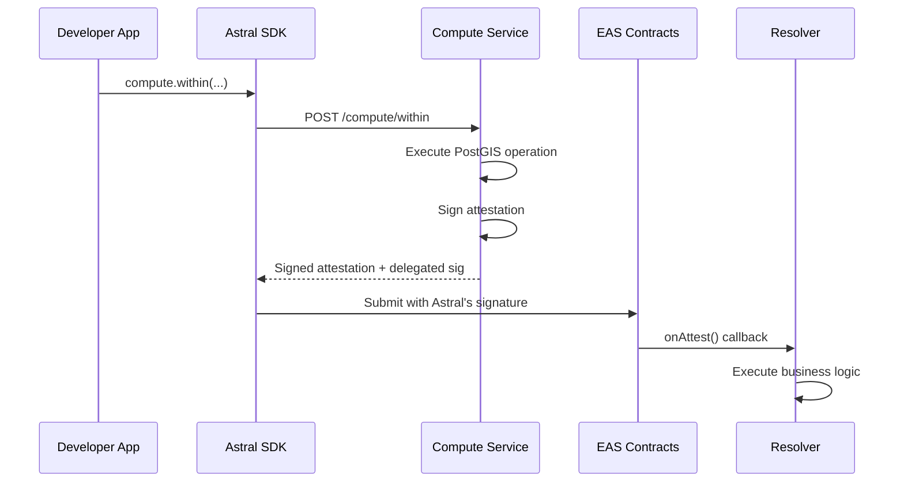

<Note>**Research Preview** — Smart contract patterns need audit. [GitHub](https://github.com/AstralProtocol)</Note>

# Blockchain integration

Astral's signed results can be submitted onchain as EAS attestations, making them available to smart contracts. This guide covers the full blockchain integration flow.

## What is EAS?

The [Ethereum Attestation Service](https://docs.attest.org/) (EAS) is an open protocol for making onchain and offchain attestations. Attestations are structured, signed claims — "entity X attests that Y is true."

EAS supports two storage modes:

- **Onchain attestations** — stored directly in EAS contracts, referenced by UID
- **Offchain attestations** — signed with EIP-712, stored on IPFS or other storage, verifiable without gas costs

Astral uses EAS to package signed spatial results as attestations that smart contracts can consume and act on.

## The pattern

The core flow: compute a spatial result, sign it, submit it onchain, and let a resolver contract react.



## Delegated attestation flow

Astral uses EAS's **delegated attestation** pattern to separate signing from submission:



The delegated attestation pattern means:

- **Astral signs** the attestation data offchain (inside the TEE)
- **Developer submits** with Astral's signature (pays gas)
- **EAS verifies** the signature and records Astral as attester
- **Resolver contracts** can verify `attestation.attester == astralSigner`

```typescript
const result = await astral.compute.within({
  geometry: uid1,
  target: uid2,
  radius: 500,
  chainId: 84532,
  schema: RESOLVER_SCHEMA_UID,
  recipient: userAddress
});

// Submit to EAS — triggers your resolver
const tx = await astral.eas.submitDelegated(result.delegatedAttestation);
await tx.wait();
```

The `delegatedAttestation.deadline` indicates when the signature expires. Submissions after the deadline will fail:

```typescript
if (Date.now() / 1000 < result.delegatedAttestation.deadline) {
  await astral.eas.submitDelegated(result.delegatedAttestation);
}
```

## Writing a resolver contract

In EAS, a **resolver** is a smart contract that gets called whenever an attestation is made against a specific schema. This enables:

- **Validation** — accept or reject attestations based on custom logic
- **Side effects** — execute actions atomically with attestation creation
- **Composability** — combine attestations with any onchain logic

### Basic resolver (LocationGatedAction)

<Info>
  **About the Astral signer**: The `astralSigner` address is the key that signs attestations inside the TEE. Signer management (multisig, key rotation, etc.) is on the roadmap. See [Security](/resources/security) for more details.
</Info>

```solidity
// SPDX-License-Identifier: MIT
pragma solidity ^0.8.0;

import "@eas/contracts/resolver/SchemaResolver.sol";
import "@openzeppelin/contracts/access/Ownable.sol";

contract LocationGatedAction is SchemaResolver, Ownable {
    address public astralSigner;

    constructor(IEAS eas, address _astralSigner) SchemaResolver(eas) {
        astralSigner = _astralSigner;
    }

    function onAttest(
        Attestation calldata attestation,
        uint256 /* value */
    ) internal override returns (bool) {
        // 1. Verify from Astral
        require(attestation.attester == astralSigner, "Not from Astral");

        // 2. Decode policy result (BooleanPolicyAttestation)
        (
            bool result,
            bytes32[] memory inputRefs,
            uint64 timestamp,
            string memory operation
        ) = abi.decode(
            attestation.data,
            (bool, bytes32[], uint64, string)
        );

        // 3. Execute business logic
        require(result, "Policy check failed");
        _executeAction(attestation.recipient);

        return true;
    }

    function onRevoke(Attestation calldata, uint256)
        internal pure override returns (bool)
    {
        return false;  // Don't allow revocation
    }

    function _executeAction(address recipient) internal virtual {
        // Override in child contracts
    }

    // Owner-controlled signer update for key rotation
    function updateAstralSigner(address newSigner) external onlyOwner {
        astralSigner = newSigner;
    }
}
```

### Common patterns

#### NFT minting

```solidity
contract LocationNFT is LocationGatedAction, ERC721 {
    mapping(address => bool) public hasMinted;
    uint256 public nextTokenId = 1;

    function _executeAction(address recipient) internal override {
        require(!hasMinted[recipient], "Already minted");
        hasMinted[recipient] = true;
        _mint(recipient, nextTokenId++);
    }
}
```

#### Token distribution

```solidity
contract LocationAirdrop is LocationGatedAction {
    IERC20 public token;
    uint256 public amount;

    function _executeAction(address recipient) internal override {
        token.transfer(recipient, amount);
    }
}
```

#### Access control

```solidity
contract LocationGate is LocationGatedAction {
    mapping(address => bool) public hasAccess;

    function _executeAction(address recipient) internal override {
        hasAccess[recipient] = true;
    }

    modifier onlyVerified() {
        require(hasAccess[msg.sender], "Location not verified");
        _;
    }
}
```

#### Numeric policies (distance-based)

Use numeric attestations (distance, area, length) for more sophisticated logic like [spatial demurrage](https://www.johnx.co/notes/spatial-demurrage) — where transfer fees vary based on distance from a target location.

```solidity
// Decode numeric policy attestation
(
    uint256 distanceCm,
    string memory units,
    bytes32[] memory inputRefs,
    uint64 timestamp,
    string memory operation
) = abi.decode(attestation.data, (uint256, string, bytes32[], uint64, string));

// Apply distance-based fee (example: 0.1% per km from target)
uint256 distanceKm = distanceCm / 100000;
uint256 fee = (amount * distanceKm) / 1000;
```

### Decoding attestation data

#### Boolean policies

```solidity
(
    bool result,
    bytes32[] memory inputRefs,
    uint64 timestamp,
    string memory operation
) = abi.decode(
    attestation.data,
    (bool, bytes32[], uint64, string)
);
```

#### Numeric policies

```solidity
(
    uint256 result,        // Scaled integer (centimeters)
    string memory units,   // "meters" or "square_meters"
    bytes32[] memory inputRefs,
    uint64 timestamp,
    string memory operation
) = abi.decode(
    attestation.data,
    (uint256, string, bytes32[], uint64, string)
);

// Convert back to meters
uint256 meters = result / 100;
```

## Registering your schema

Before submitting attestations, register your schema with EAS and point it at your resolver:

```typescript
import { SchemaRegistry } from '@ethereum-attestation-service/eas-sdk';

const schemaRegistry = new SchemaRegistry(SCHEMA_REGISTRY_ADDRESS);

// Boolean policy schema
const boolSchema = "bool result,bytes32[] inputRefs,uint64 timestamp,string operation";

const tx = await schemaRegistry.connect(signer).register({
  schema: boolSchema,
  resolverAddress: yourResolver.address,
  revocable: false
});

const receipt = await tx.wait();
const schemaUID = receipt.logs[0].args.uid;
```

## Onchain vs offchain location records

Location attestations — the spatial inputs to computations — can be stored onchain or offchain:

<CardGroup cols={2}>
  <Card title="Onchain attestations" icon="link">
    - Stored on EAS contracts
    - Referenced by UID alone
    - Higher gas cost
    - Permanent, immutable
  </Card>
  <Card title="Offchain attestations" icon="cloud">
    - Stored on IPFS, servers, etc.
    - Referenced by UID + URI
    - No gas cost to create
    - EIP-712 signed
  </Card>
</CardGroup>

### Onchain

```typescript
// Create onchain attestation
const location = await astral.location.create(geojson, {
  submitOnchain: true
});

// Reference by UID only
await astral.compute.distance(location.uid, otherUID);
```

### Offchain

```typescript
// Create offchain attestation
const location = await astral.location.create(geojson, {
  submitOnchain: false,
  storage: 'ipfs'  // or 'arweave', 'https', etc.
});

// Reference by UID + URI
await astral.compute.distance(
  { uid: location.uid, uri: location.uri },
  otherUID
);
```

## Chain configuration

Astral supports EAS on multiple EVM-compatible chains. See [Schema registry](/resources/schemas) for schema UIDs by chain.

## Verification best practices

<AccordionGroup>
  <Accordion title="Verify attester" icon="shield-check">
    Always check `attestation.attester == astralSigner`:
    ```solidity
    require(attestation.attester == astralSigner, "Not from Astral");
    ```
  </Accordion>
  <Accordion title="Check timestamp" icon="clock">
    Prevent replay of old attestations:
    ```solidity
    require(timestamp > block.timestamp - 1 hours, "Attestation too old");
    ```
  </Accordion>
  <Accordion title="Verify input references" icon="link">
    Ensure the right locations were checked:
    ```solidity
    require(inputRefs[1] == EXPECTED_LANDMARK_UID, "Wrong location");
    ```
  </Accordion>
  <Accordion title="Track used attestations" icon="list-check">
    Prevent reuse of attestations:
    ```solidity
    mapping(bytes32 => bool) public usedAttestations;

    function onAttest(...) {
        bytes32 attUid = keccak256(abi.encode(attestation));
        require(!usedAttestations[attUid], "Already used");
        usedAttestations[attUid] = true;
    }
    ```
  </Accordion>
</AccordionGroup>

## Key rotation

Resolver contracts should support updating the Astral signer address. For the research preview, a simple owner-controlled approach works:

```solidity
function updateAstralSigner(address newSigner) external onlyOwner {
    emit SignerUpdated(astralSigner, newSigner);
    astralSigner = newSigner;
}
```

<Note>
  For production deployments, you may want the owner to be a multisig. We plan to provide more graceful key rotation mechanisms in future releases.
</Note>
