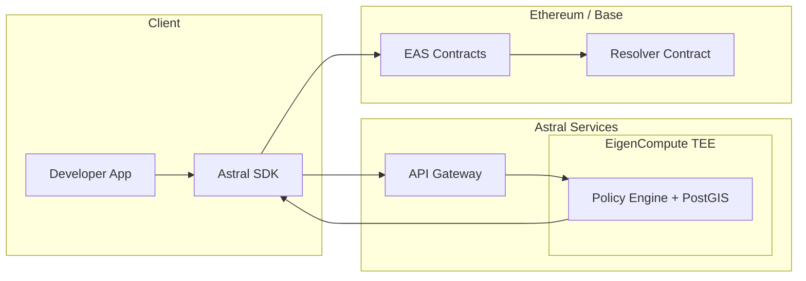
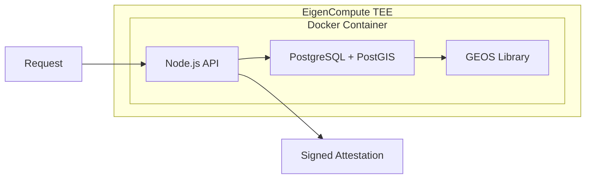
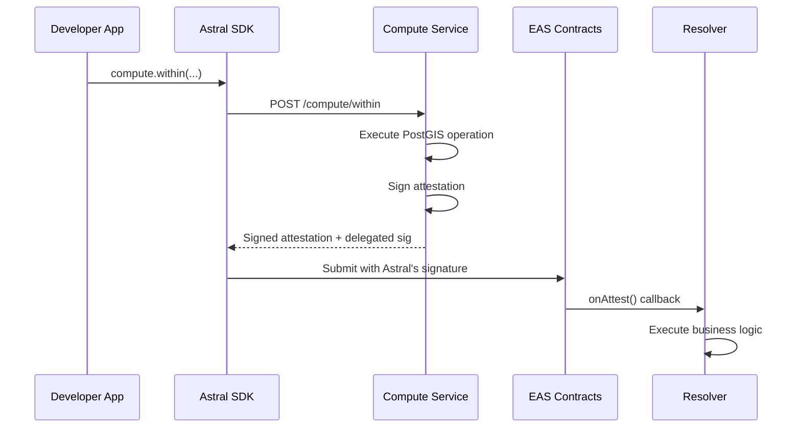

<Warning>
  **Research Preview** — Architecture is under active development.
</Warning>

# How Astral Location Services Work

Astral provides verifiable geospatial computation by combining three key technologies: **PostGIS** for spatial operations, **EigenCompute TEE** for verifiable execution, and **EAS** for attestation management.

## System Architecture

## Key Architectural Decisions

<AccordionGroup>
  <Accordion title="Self-Contained Container" icon="box">
    PostGIS runs **inside** the Docker container, not as an external service. This is essential for verifiable computation in the TEE — no external dependencies means the entire execution environment is attested.
  </Accordion>
  <Accordion title="Stateless Model" icon="rotate">
    Each request brings all required inputs. No persistent state between requests. This ensures determinism and simplifies verification — same inputs always produce same outputs. (Note: additional testing is needed to fully validate determinism across different environments.)
  </Accordion>
  <Accordion title="Delegated Attestations" icon="signature">
    Developers submit Policy Attestations onchain using EAS's delegated attestation pattern. Astral signs, developer pays gas, Astral is recorded as the attester.
  </Accordion>
</AccordionGroup>

## The Computation Flow

<Steps>
  <Step title="Request Arrives">
    Developer's app calls `astral.compute.within(uid1, uid2, 500)` via the SDK
  </Step>
  <Step title="Input Resolution">
    The compute service fetches/validates location attestations by UID, or accepts raw GeoJSON
  </Step>
  <Step title="Spatial Computation">
    PostGIS executes the spatial operation (e.g., `ST_DWithin`) inside the TEE
  </Step>
  <Step title="Result Signing">
    The service creates a Policy Attestation and signs it with the TEE-held key
  </Step>
  <Step title="Response">
    Signed attestation returned to SDK, ready for offchain use or onchain submission
  </Step>
</Steps>

## Verifiable Execution with EigenCompute

The Geospatial Policy Engine runs in **EigenCompute**, part of the EigenCloud ecosystem:

<Info>
  PostGIS uses [GEOS](https://libgeos.org/) for geometry operations — the same C++ library used by QGIS, GDAL, and most professional geospatial software. See the [GEOS documentation](https://libgeos.org/usage/download/) for more on its reliability and widespread adoption.
</Info>

### Verifiability Properties

| Property | How It's Achieved |
|----------|-------------------|
| **Input Verification** | Attestation signatures verified at TEE boundary |
| **Deterministic Computation** | Same inputs always produce same result |
| **Signed Output** | Service key signs Policy Attestation inside TEE |
| **TEE Attestation** | EigenCompute provides hardware attestation of execution |

## Input Resolution

The service accepts multiple input formats:

| Input Format | Resolution |
|--------------|------------|
| UID string | Fetch from EAS contracts (onchain attestations) |
| `{ uid, uri }` | Fetch from URI, verify UID matches, verify signature |
| `{ attestation }` | Verify signature, extract geometry directly |
| Raw GeoJSON | Use directly, hash for `inputRefs` |

<Note>
  For offchain attestations, the UID is deterministically derived from the attestation data. Even when fetching from HTTPS (not content-addressed), we verify the fetched attestation produces the expected UID. Mismatch = reject.
</Note>

## Delegated Attestation Flow

The delegated attestation pattern means:
- **Astral signs** the attestation data offchain
- **Developer submits** with Astral's signature (pays gas)
- **EAS verifies** the signature and records Astral as attester
- **Resolver contracts** can verify `attestation.attester == astralSigner`

<Note>
  Resolver contracts must be deployed and registered by the developer. Astral does not provide pre-built resolver contracts — you create them to implement your specific business logic. See [EAS Resolvers](/concepts/eas-resolvers) for patterns and examples.
</Note>

## Trust Model

There are two distinct trust questions in location-based systems:

### 1. Are the inputs truthful?

This is the **location verification problem** — how do you know a user was actually at the location they claim? GPS is spoofable, and proving physical presence remains an open research problem.

We're actively working on this through our [Location Proof framework](https://collective.flashbots.net/t/towards-stronger-location-proofs/5323). For now, Astral Location Services trust the location data provided as input.

### 2. Was the computation performed correctly?

This is what Astral Location Services solve. Given location inputs, how do you prove the geospatial computation (distance, containment, etc.) was performed correctly?

**Current approach:**
- **Open source code**: The compute service code is public and auditable
- **TEE execution**: Code runs inside EigenCompute's trusted execution environment
- **Astral signing key**: Attestations are signed by a key held inside the TEE
- **Deterministic operations**: Same inputs produce same outputs (additional testing in progress)

**Future improvements:**
- **AVS Consensus**: Multiple operators verify computations
- **ZK Proofs**: Cryptographic proof of correct execution
- **Decentralized Signers**: Multi-party attestation signing

<Card title="Next: Core Concepts" icon="book" href="/concepts/location-attestations">
  Deep dive into Location Attestations
</Card>
