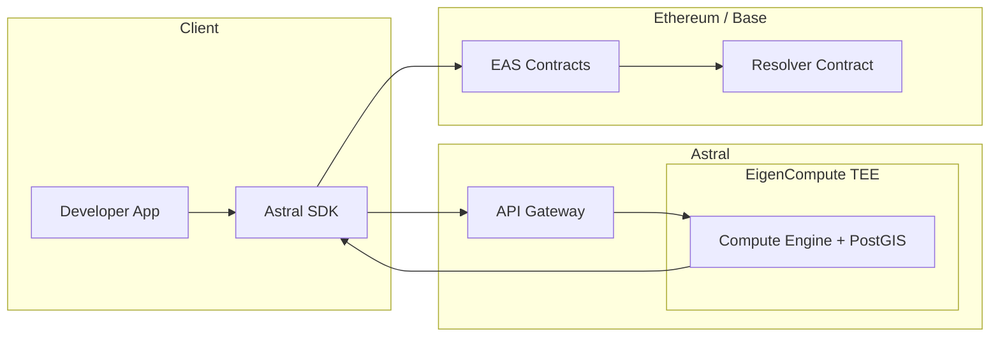
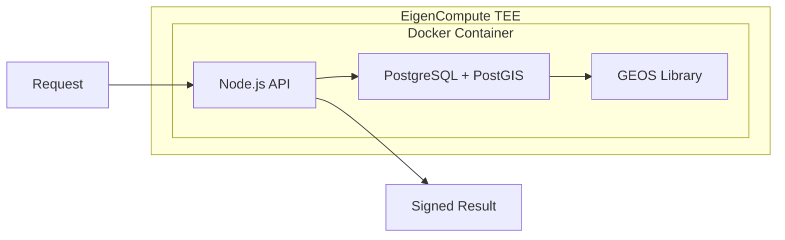

<Note>**Research preview** — APIs may change. [GitHub](https://github.com/AstralProtocol)</Note>

# How it works

Astral runs spatial computations inside a Trusted Execution Environment and returns signed results. Here's what happens under the hood.

The core flow: geometry in, TEE computes, signed result out. The result can go anywhere — an agent, a smart contract, a database, a compliance report.

## System architecture

```mermaid
flowchart LR
    subgraph Client["Client"]
        App[Developer App]
        SDK[Astral SDK]
    end

    subgraph Astral["Astral"]
        API[API Gateway]
        subgraph TEE["EigenCompute TEE"]
            Engine[Compute Engine + PostGIS]
        end
    end

    subgraph Chain["Ethereum / Base"]
        EAS[EAS Contracts]
        Resolver[Resolver Contract]
    end

    App --> SDK
    SDK --> API
    API --> Engine
    Engine --> SDK
    SDK --> EAS
    EAS --> Resolver
```

## Key architectural decisions

<AccordionGroup>
  <Accordion title="Self-contained container" icon="box">
    PostGIS runs **inside** the Docker container, not as an external service. This is essential for verifiable computation in the TEE — no external dependencies means the entire execution environment is attested.
  </Accordion>
  <Accordion title="Stateless model" icon="rotate">
    Each request brings all required inputs. No persistent state between requests. This ensures determinism and simplifies verification — same inputs always produce same outputs. (Note: additional testing is needed to fully validate determinism across different environments.)
  </Accordion>
  <Accordion title="Delegated attestations" icon="signature">
    Developers submit signed results onchain using EAS's delegated attestation pattern. Astral signs, the developer pays gas, and Astral is recorded as the attester.
  </Accordion>
</AccordionGroup>

## The computation flow

<Steps>
  <Step title="Request arrives">
    Developer's app calls `astral.compute.within(uid1, uid2, 500)` via the SDK
  </Step>
  <Step title="Input resolution">
    The compute service fetches and validates location records by UID, or accepts raw GeoJSON
  </Step>
  <Step title="Spatial computation">
    PostGIS executes the spatial operation (e.g., `ST_DWithin`) inside the TEE
  </Step>
  <Step title="Result signing">
    The service creates a signed result using the TEE-held key
  </Step>
  <Step title="Response">
    The signed result is returned to the SDK, ready for offchain use or onchain submission
  </Step>
</Steps>

## Verifiable execution with EigenCompute

The compute engine runs in **EigenCompute**, part of the EigenCloud ecosystem:

```mermaid
flowchart LR
    subgraph TEE["EigenCompute TEE"]
        subgraph Container["Docker Container"]
            API[Node.js API] --> PostGIS[PostgreSQL + PostGIS]
            PostGIS --> GEOS[GEOS Library]
        end
    end

    Input[Request] --> API
    API --> Output[Signed Result]
```

<Info>
  PostGIS uses [GEOS](https://libgeos.org/) for geometry operations — the same C++ library used by QGIS, GDAL, and most professional geospatial software. See the [GEOS documentation](https://libgeos.org/usage/download/) for more on its reliability and widespread adoption.
</Info>

### Verifiability properties

| Property | How it's achieved |
|----------|-------------------|
| **Input verification** | Attestation signatures verified at TEE boundary |
| **Deterministic computation** | Same inputs always produce same result |
| **Signed output** | Service key signs the result inside the TEE |
| **TEE attestation** | EigenCompute provides hardware attestation of execution |

## Input resolution

The service accepts multiple input formats:

| Input format | Resolution |
|--------------|------------|
| UID string | Fetch from EAS contracts (onchain attestations) |
| `{ uid, uri }` | Fetch from URI, verify UID matches, verify signature |
| `{ attestation }` | Verify signature, extract geometry directly |
| Raw GeoJSON | Use directly, hash for `inputRefs` |

<Note>
  For offchain attestations, the UID is deterministically derived from the attestation data. Even when fetching from HTTPS (not content-addressed), Astral verifies the fetched attestation produces the expected UID. Mismatch = reject.
</Note>

## Delegated attestation flow

For the full blockchain integration flow, see [Blockchain integration](/guides/blockchain-integration).

The delegated attestation pattern means:
- **Astral signs** the attestation data offchain
- **Developer submits** with Astral's signature (pays gas)
- **EAS verifies** the signature and records Astral as attester
- **Resolver contracts** can verify `attestation.attester == astralSigner`

<Note>
  Resolver contracts must be deployed and registered by the developer. Astral does not provide pre-built resolver contracts — you create them to implement your specific business logic. See [EAS Resolvers](/concepts/eas-resolvers) for patterns and examples.
</Note>

## Trust model

There are two distinct trust questions in location-based systems:

### 1. Are the inputs truthful?

This is the **location verification problem** — how do you know a user was actually at the location they claim? GPS is spoofable, and proving physical presence remains an open research problem.

We're actively working on this through our [location proof framework](https://collective.flashbots.net/t/towards-stronger-location-proofs/5323). For now, Astral trusts the location data provided as input.

### 2. Was the computation performed correctly?

This is what Astral solves. Given location inputs, how do you prove the geocomputation (distance, containment, etc.) was performed correctly?

**Current approach:**
- **Open source code**: The compute service code is public and auditable
- **TEE execution**: Code runs inside EigenCompute's trusted execution environment
- **Astral signing key**: Results are signed by a key held inside the TEE
- **Deterministic operations**: Same inputs produce same outputs (additional testing in progress)

**Future improvements:**
- **AVS consensus**: Multiple operators verify computations
- **ZK proofs**: Cryptographic proof of correct execution
- **Decentralized signers**: Multi-party result signing

<Card title="Next: Geographic features" icon="map" href="/concepts/geographic-features">
  How Astral represents spatial data
</Card>
