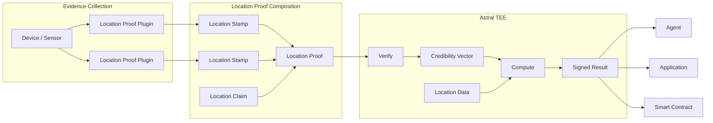

<Note>**Research preview** — APIs may change. [GitHub](https://github.com/AstralProtocol)</Note>

# How it works

Location data is easy to fake and hard to verify. GPS can be spoofed with a $20 app. IP geolocation is trivially manipulated. Self-reported coordinates carry no proof of origin. When a delivery platform confirms a drop-off, a compliance system checks a geofence, or an autonomous agent makes a spatial decision — the location data underneath is taken on faith.

Astral exists to change that. The system provides a pipeline that collects location evidence, bundles it into verifiable artifacts, evaluates its credibility, runs spatial computations on it, and delivers signed results that any downstream system can independently verify.

## The pipeline

### 1. Collect location evidence

Devices collect signals from **proof-of-location systems** — independent systems that produce evidence about where something is. A phone's secure enclave can attest to sensor readings. A network of infrastructure nodes can triangulate position via latency measurements. Each system has different strengths, weaknesses, and trust properties.

[Location proof plugins](/plugins/overview) wrap each proof-of-location system behind a common interface. This makes it possible to compose evidence from multiple independent sources without writing custom integration code for each one.

**Why this step matters:** Self-reported location is trivially spoofable. Evidence from independent proof-of-location systems raises the cost of forgery — which is the real goal, since absolute certainty about physical location is rarely achievable.

### 2. Create a location proof

Raw signals become **location stamps** — structured evidence from a single proof-of-location system about an observed location. Each location stamp carries enough information to verify its internal validity: signatures, temporal footprint, and plugin identification.

One or more location stamps bundle with a **location claim** — an assertion about where and when an event occurred — to form a **location proof**. The location proof is the verifiable artifact: a claim paired with its supporting evidence.

**Why this step matters:** Structured, composable evidence instead of raw coordinates. A location proof separates the assertion ("I was here") from the evidence ("here's why you should believe me"), which makes both independently evaluable.

### 3. Verify the location proof

Submit the location proof to Astral's verification endpoint. Inside a Trusted Execution Environment (TEE), the system evaluates each location stamp — checking signatures, structure, and signal consistency — then assesses how well the evidence supports the location claim. For multi-stamp location proofs, it also cross-correlates across independent sources.

The output is a **credibility vector**: structured scores across multiple dimensions (spatial, temporal, validity, independence), not a binary yes/no. Applications decide what threshold they need.

**Why this step matters:** Independent, structured evaluation of location evidence. The credibility vector gives applications enough information to make risk-appropriate decisions — a $10 check-in reward can accept lower confidence than a $10M land title transfer.

### 4. Compute spatial relationships

Run geospatial operations — distance, containment, intersection, area, length — on location data inside the TEE. The compute endpoints accept raw GeoJSON, signed location records, or verified location proofs as inputs. PostGIS (backed by the GEOS library, the same engine behind QGIS and GDAL) performs the computation; the TEE signs the result.

**Why this step matters:** Verifiable spatial answers. The signed result proves not just "what was the answer" but "the answer was computed correctly by trusted code on these specific inputs."

### 5. Use the signed result

The signed result goes wherever it needs to — an autonomous agent's decision loop, a backend database, a compliance report, or a smart contract via EAS attestation. It carries its own proof of correctness, so any downstream consumer can verify it independently without re-executing the computation or trusting the intermediary.

**Why this step matters:** Portable, independently verifiable spatial facts. The result is useful whether it stays offchain or goes onchain.

## Architecture

```mermaid
graph LR
    subgraph Evidence Collection
        D[Device / Sensor] --> P1[Location Proof Plugin]
        D --> P2[Location Proof Plugin]
    end

    subgraph Location Proof Composition
        P1 --> S1[Location Stamp]
        P2 --> S2[Location Stamp]
        S1 --> LP[Location Proof]
        S2 --> LP
        CL[Location Claim] --> LP
    end

    subgraph Astral TEE
        LP --> VE[Verify]
        VE --> CR[Credibility Vector]
        CR --> CO[Compute]
        LD[Location Data] --> CO
        CO --> SR[Signed Result]
    end

    SR --> AG[Agent]
    SR --> AP[Application]
    SR --> SC[Smart Contract]
```

The two paths through the system serve different needs:

- **Location proofs path** (left → center): Evidence collection → composition → verification. Produces a credibility vector that tells you how much to trust the location claim. The verified location proof can then flow into compute, or be used on its own.
- **Geocomputation path** (center → right): Location data (raw, signed, or verified) → spatial operation → signed result. Produces a cryptographically signed spatial answer.

A verified location proof is valuable on its own — it doesn't need to flow into a compute operation. And a compute operation can run on any location data, not just verified location proofs. The two capabilities compose but don't require each other.

## What's verified vs. what's trusted

The TEE guarantees that computation executes correctly — the code that ran is the code that was attested, inputs weren't tampered with, and the signing key never leaves the enclave. That's the "verifiable" part.

The truthfulness of location inputs is a separate question. It depends on the strength of the location proof: how many independent proof-of-location systems contributed evidence, how resistant those systems are to forgery, and whether the evidence is consistent. Astral evaluates this and reports it honestly via the credibility vector — but it cannot make weak evidence strong.

For a detailed accounting of what exactly is verified and what trust assumptions remain, see the [Trust Model](/trust-model/architecture).

<Card title="Next: Location data" icon="map" href="/concepts/location-data">
  How Astral represents and verifies spatial data
</Card>
