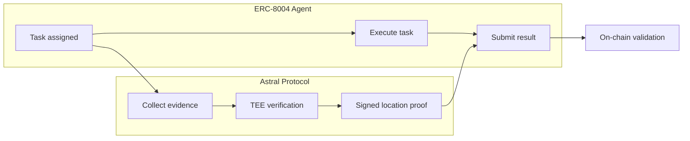

<Note>**Research preview** — This integration is under active development. Interfaces may change. [GitHub](https://github.com/pblvrt/openclaw-location-plugin)</Note>

# ERC-8004 + Astral

[ERC-8004](https://ethereum-magicians.org/t/erc-8004-autonomous-agents) gives autonomous agents identity, reputation, task delegation, and on-chain validation. It answers *who* an agent is, *what* it can do, and *whether* it did it correctly.

It doesn't answer **where the agent is**.

A growing class of agent tasks — deliveries, inspections, environmental monitoring, physical-world services — require verifiable proof of location. Without it, an agent's claim to be "at the delivery address" or "at the inspection site" is self-reported and unverifiable. ERC-8004 validators can check computational correctness, but they can't check physical presence.

Astral fills that gap. By combining Astral's verifiable location infrastructure with ERC-8004's agent framework, agents can prove *where* they are — not just *what* they did.

## The three layers

| Layer | Responsibility | Provider |
|-------|---------------|----------|
| **Agent** | Identity, task execution, reputation | ERC-8004 |
| **Location** | Spatial proofs, verification, geocomputation | Astral Protocol |
| **Consensus** | On-chain validation and settlement | EVM chain |

## How it works



1. **Task assignment** — An ERC-8004 task includes a spatial constraint (e.g., "must be within 50m of 52.3676°N, 4.9041°E")
2. **Evidence collection** — The agent collects location evidence from multiple signal sources (GNSS, WiFi, cell towers)
3. **TEE verification** — Astral processes the evidence in a Trusted Execution Environment, cross-correlates signals, and produces a signed location proof with a credibility score
4. **Result submission** — The signed proof is bundled with the agent's task result and submitted on-chain
5. **Validation** — ERC-8004 validators check both the task result *and* the location proof

## What Astral adds to ERC-8004

### TEE-attested verification → task validation

Astral processes location evidence inside Trusted Execution Environments. The TEE attestation chain provides a hardware-rooted guarantee that location data wasn't tampered with. In ERC-8004 terms, this becomes an additional validation input — the location proof carries the same trust properties as the TEE that produced it.

### Credibility vectors → agent reputation

Astral assigns credibility scores to location claims based on signal quality, consistency, and historical accuracy. These feed directly into ERC-8004's reputation system: agents with consistently verifiable locations build spatial reputation. Agents that claim to be places they aren't see their credibility degrade.

### Geocomputation → spatial constraints

Astral's geocomputation capabilities — geofencing, proximity checks, route verification, area coverage — map to ERC-8004 task constraints. A task can specify spatial requirements that are evaluated by Astral, with results returned as signed attestations.

### Signed results → on-chain proofs

Every Astral verification produces a cryptographically signed result. These signatures are verifiable on-chain, making them native inputs to ERC-8004 smart contract validation logic. No oracle required — the proof is self-contained.

## Location-bound task results

An agent's task result is cryptographically bound to a verified location. The proof isn't "agent says it was here" — it's "Astral verified the agent was here, in a TEE, using cross-correlated signals, and signed the result."

```json
{
  "agent_id": "0xABCD...",
  "task_id": 42,
  "result": "<task output>",
  "location_proof": {
    "coordinates": { "lat": 52.3676, "lng": 4.9041 },
    "accuracy": 12,
    "timestamp": 1709251200,
    "signals_used": ["gnss", "wifi_fingerprint", "cell_tower"],
    "credibility": 0.94,
    "tee_attestation": "0x1234...",
    "astral_signature": "0x5678..."
  }
}
```

## Continuous verification

For tasks that require presence over time — monitoring, guarding, patrolling — Astral can produce a continuous verification stream: a series of time-stamped, signed location proofs that together attest to an agent's trajectory or sustained presence.

```json
{
  "agent_id": "0xABCD...",
  "task_id": 42,
  "proofs": [
    { "timestamp": 1709251200, "coordinates": { "lat": 52.3676, "lng": 4.9041 }, "credibility": 0.94 },
    { "timestamp": 1709251260, "coordinates": { "lat": 52.3677, "lng": 4.9042 }, "credibility": 0.91 },
    { "timestamp": 1709251320, "coordinates": { "lat": 52.3676, "lng": 4.9040 }, "credibility": 0.95 }
  ],
  "trajectory_hash": "0xABCD...",
  "astral_signature": "0x5678..."
}
```

## Use cases unlocked

<CardGroup cols={2}>
  <Card title="Trustless delivery" icon="truck">
    Courier must produce an Astral-verified proof within 30m of the delivery point. Payment releases automatically on proof submission.
  </Card>
  <Card title="Environmental monitoring" icon="leaf">
    Each sensor reading is bound to a verified location. Coverage gaps are detectable. A single agent can't fake data for multiple stations.
  </Card>
  <Card title="Infrastructure inspection" icon="building">
    Agents dispatched to inspect properties must prove physical presence at the site before submitting reports.
  </Card>
  <Card title="Spatial task routing" icon="route">
    Query Astral's spatial index for verified-present agents near a target location, then route tasks deterministically.
  </Card>
</CardGroup>

## Credibility is a spectrum

Astral doesn't output binary "verified / not verified." It produces a **credibility score** reflecting signal quality, consistency, and confidence. Task issuers set their own minimum thresholds based on risk tolerance:

- A casual check-in might accept **0.6**
- A routine delivery might require **0.8**
- A high-value asset transfer might require **0.95**

This maps naturally to ERC-8004's validation model — different tasks can demand different levels of spatial assurance.

## Trust model

| Claim | Verification method | Trust root |
|-------|-------------------|------------|
| Agent was at location X at time T | TEE-processed cross-correlated signals | Hardware attestation + Astral signature |
| Location proof is authentic | Cryptographic signature verification | Astral's signing key |
| Agent meets spatial constraint | On-chain geofence check | Smart contract logic |
| Credibility score is accurate | Multi-signal cross-correlation in TEE | Signal diversity + TEE integrity |

For a detailed discussion of what's verified vs. what's trusted, see the [Trust Model](/trust-model/architecture).

## Open questions

These are active areas of research and design:

1. **On-chain proof size** — Full proofs with TEE attestations can be large. Should only the hash go on-chain, with full proofs on IPFS/Arweave?
2. **Proof freshness** — How recent must a location proof be? Should tasks include a `maxProofAge` parameter?
3. **Privacy** — Can Astral produce zero-knowledge spatial proofs? ("Agent is within the geofence" without revealing exact coordinates.)
4. **Agent collusion** — Colluding agents could co-attest false locations. How does the credibility model handle spatial Sybil attacks?
5. **Standard extension** — Should location verification become a formal ERC-8004 extension (EIP), or remain a plugin-level integration?

<CardGroup cols={2}>
  <Card title="OpenClaw plugin" icon="plug" href="/integrations/openclaw">
    Reference implementation and smart contract interfaces
  </Card>
  <Card title="Trust model" icon="shield-check" href="/trust-model/architecture">
    What the system verifies vs. what it assumes
  </Card>
</CardGroup>
