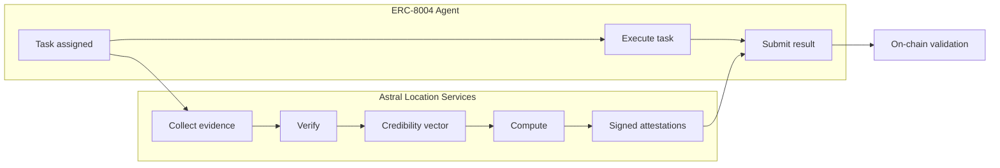

<Note>**Research preview** — This integration is under active development. Interfaces may change.</Note>

# ERC-8004 + Astral

[ERC-8004](https://ethereum-magicians.org/t/erc-8004-autonomous-agents) gives autonomous agents identity, reputation, task delegation, and on-chain validation. It answers *who* an agent is, *what* it can do, and *whether* it did it correctly.

It doesn't answer **where the agent is**.

A growing class of agent tasks — deliveries, inspections, environmental monitoring, data residency, compute jobs anchored to physical infrastructure — require verifiable proof of location. Without it, an agent's claim to be "at the delivery address" or "at the inspection site" is self-reported and unverifiable. ERC-8004 validators can check computational correctness, but they can't check physical presence.

Astral fills that gap. By combining Astral's verifiable location infrastructure with ERC-8004's agent framework, agents can prove *where* they are — not just *what* they did.

## The three layers

| Layer | Responsibility | Provider |
|-------|---------------|----------|
| **Agent** | Identity, task execution, reputation | ERC-8004 |
| **Location** | Location proofs, verification, geocomputation | Astral Protocol |
| **Consensus** | On-chain validation and settlement | EVM chain |

## How it works

[Astral Location Services](/concepts/astral-location-services) is a verifiable geospatial computation service that runs inside a Trusted Execution Environment. It exposes two modules:

- **[Verify](/concepts/verify)** — Verifies location proofs: checks each stamp's signatures, structure, and signal consistency, cross-correlates evidence from independent sources, and produces a [credibility vector](/concepts/location-proof-evaluation).
- **[Compute](/concepts/compute)** — Computes spatial relationships between geographic features: distance, containment, intersection, area. This is how spatial constraints in tasks get checked — e.g., "is this verified location within the required geofence?"

Both endpoints run inside the TEE, and both produce cryptographically signed [EAS attestations](/concepts/signed-results).

1. **Task assignment** — An ERC-8004 task includes a spatial constraint (e.g., "must be within 50m of 52.3676°N, 4.9041°E")
2. **Evidence collection** — The agent uses [location proof plugins](/plugins/overview) to collect location evidence from multiple independent signal sources. Each plugin connects with a different [proof-of-location system](/concepts/pol-systems) — GPS hardware, WiFi geolocation, IP lookup, device attestation, infrastructure triangulation — and provides a common interface.
3. **Verification** — The agent submits the location proof to Astral's [Verify](/concepts/verify) endpoint. It checks each [location stamp's](/concepts/location-stamps) internal validity, cross-correlates evidence from independent sources, and evaluates how well the evidence supports the claim. The output is a [credibility vector](/concepts/location-proof-evaluation) — a multi-dimensional assessment across spatial, temporal, validity, and independence dimensions.
4. **Constraint check** — The agent uses Astral's [Compute](/concepts/compute) endpoint to check the verified location against the task's spatial constraint — e.g., a containment check against a geofence, or a distance check from a target point. Compute compares geographic features and returns a signed result.
5. **Signed attestations** — Both the credibility vector and the constraint check result are signed as [EAS attestations](/concepts/signed-results). The signing key lives inside the TEE and cannot be extracted — a valid signature proves the result came from Astral's attested code.
6. **Result submission** — The signed attestations are bundled with the agent's task result and submitted on-chain. ERC-8004 validators check the Astral signatures to verify both the location evidence and the spatial constraint were evaluated correctly.

## What Astral adds to ERC-8004

### Verifiable location evaluation

Astral's Verify endpoint runs inside a TEE, providing hardware attestation that the verification code ran as deployed, the credibility vector was computed correctly, and the signed output hasn't been tampered with. The TEE signing key cannot be extracted by the operator — a valid signature is proof the result came from the attested environment.

The strength of the underlying evidence depends on the [plugins](/plugins/overview) used. Each plugin connects with a proof-of-location system that has its own trust properties — from hardware-rooted device attestation to lightweight IP geolocation. The [credibility vector](/concepts/location-proof-evaluation) surfaces these differences so applications can make informed decisions. The exact structure and dimensions of the credibility vector are an active area of [research](https://github.com/AstralProtocol/research).

### Verifiable geocomputation

Astral's [Compute](/concepts/compute) endpoint compares and computes relationships between geographic features — distances, containment, intersections, areas — inside the TEE. This is what makes spatial constraints enforceable: a task says "agent must be within this geofence," and Compute produces a signed attestation confirming whether the condition is met.

### Signed attestations on-chain

Every result from Astral Location Services — whether from Verify or Compute — is a cryptographically signed [EAS attestation](/concepts/signed-results). These signatures are verifiable on-chain, making them native inputs to ERC-8004 validator contracts.

## Use cases unlocked

<CardGroup cols={2}>
  <Card title="Trustless delivery" icon="truck">
    Courier must produce a multi-factor location proof within 30m of the delivery point. Payment releases automatically when the credibility vector meets the task's threshold.
  </Card>
  <Card title="Environmental monitoring" icon="leaf">
    Each sensor reading is bound to a verified location. Coverage gaps are detectable. A single agent can't fake data for multiple stations.
  </Card>
  <Card title="Infrastructure inspection" icon="building">
    Agents dispatched to inspect properties must prove physical presence at the site before submitting reports.
  </Card>
  <Card title="Data residency" icon="server">
    Compute jobs and data storage tasks can require verifiable proof that the agent is operating from a specific jurisdiction.
  </Card>
</CardGroup>

## Trust model

| Claim | Verification method | Trust root |
|-------|-------------------|------------|
| Evidence was evaluated correctly | TEE-attested computation | TEE hardware attestation + Astral signing key |
| Spatial constraint was checked correctly | TEE-attested geocomputation | TEE hardware attestation + Astral signing key |
| Location stamps are internally valid | Plugin-level verification (signatures, structure, signal consistency) | Per-plugin — depends on the proof-of-location system |
| Location evidence is authentic at source | Plugin-specific | Varies: hardware secure elements, infrastructure attestation, cryptographic proofs |

Each [plugin](/plugins/overview) has its own trust properties. The credibility vector's dimensions — especially validity and independence — help applications distinguish between evidence backed by strong guarantees and lighter-weight signals.

For a detailed discussion, see the [Trust Model](/trust-model/architecture).

## Open questions

These are active areas of research and design:

1. **On-chain proof size** — Full credibility vectors with TEE attestations can be large. Should only the hash go on-chain, with full results on IPFS/Arweave?
2. **Proof freshness** — How recent must a location proof be? Should tasks include a `maxProofAge` parameter?
3. **Privacy** — Can Astral produce zero-knowledge spatial proofs? ("Agent is within the geofence" without revealing exact coordinates.)
4. **Agent collusion** — Colluding agents could co-attest false locations. How does the credibility model handle spatial Sybil attacks?
5. **Standard extension** — Should location verification become a formal ERC-8004 extension (EIP), or remain an integration-level pattern?

<Card title="Trust model" icon="shield-check" href="/trust-model/architecture">
  What the system verifies vs. what it assumes
</Card>
