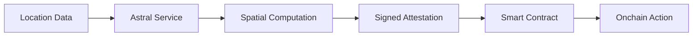

<Warning>
  **Development Preview** — Astral Location Services is under active development and not yet production-ready.
  APIs may change. This documentation describes the target specification, not the current implementation state.
  We're building in public and welcome your feedback!
</Warning>

# What is Astral Location Services?

Astral Location Services is a **verifiable geospatial computation oracle** that makes location-based smart contracts possible on Ethereum.

Think of it as **PostGIS for Ethereum** — we provide spatial operations (distance, containment, intersection) that run in a trusted execution environment and produce signed attestations you can verify onchain.

<CardGroup cols={2}>
  <Card title="Verifiable Computation" icon="shield-check">
    Operations run in a TEE via EigenCompute, providing cryptographic proof that computations were performed correctly
  </Card>
  <Card title="EAS Native" icon="file-signature">
    Results are signed EAS attestations that work seamlessly with resolver contracts for onchain actions
  </Card>
  <Card title="PostGIS Powered" icon="globe">
    Industrial-strength spatial operations backed by PostGIS — the gold standard in geospatial databases
  </Card>
  <Card title="SDK First" icon="code">
    Clean, intuitive TypeScript SDK designed for developers building location-based dApps
  </Card>
</CardGroup>

## The Core Flow



1. **Input**: Location attestations (EAS format) or raw GeoJSON
2. **Processing**: Geospatial computations in a verifiable environment (TEE)
3. **Output**: Signed Policy Attestations usable offchain and onchain

## Quick Example

```typescript
import { AstralSDK } from '@decentralized-geo/astral-sdk';

const astral = new AstralSDK({ chainId: 84532 });

// Check if user is within 500m of a landmark
const result = await astral.compute.within(
  userLocationUID,
  landmarkUID,
  500,  // meters
  { schema: RESOLVER_SCHEMA, recipient: userAddress }
);

console.log(`Nearby: ${result.result}`);

// Submit onchain (developer pays gas, Astral is attester)
if (result.result) {
  const tx = await astral.eas.submitDelegated(result.delegatedAttestation);
}
```

## Why Astral?

### The Problem

Smart contracts can't verify real-world location. GPS is spoofable. Oracles are centralized. There's no trustworthy way to gate onchain actions by physical presence.

### The Solution

Astral provides:

- **Verifiable computation** — Operations run in a TEE, not a black box
- **Composable results** — Signed attestations that any contract can verify
- **Familiar patterns** — EAS resolvers make integration natural
- **Complement, don't replace** — Use Turf.js for UX, Astral for verification

## What You Can Build

<CardGroup cols={2}>
  <Card title="Local Currencies" icon="coins" href="/use-cases#local-currencies">
    Token swaps that only work if you're in the region
  </Card>
  <Card title="Proof-of-Visit NFTs" icon="ticket" href="/use-cases#proof-of-visit">
    Collectibles for visiting landmarks
  </Card>
  <Card title="Neighborhood DAOs" icon="users" href="/use-cases#neighborhood-daos">
    Governance tokens for local residents
  </Card>
  <Card title="Delivery Verification" icon="truck" href="/use-cases#delivery-verification">
    Escrow that releases when packages arrive
  </Card>
</CardGroup>

## Architecture Overview

```
Developer App → Astral SDK → Compute Service (EigenCompute TEE) → Policy Attestation
                                     ↓
                              PostGIS (in-container)
```

The compute service runs inside EigenCompute's TEE environment with PostGIS embedded in the container, enabling verifiable geospatial computation with no external dependencies.

<Card title="Next: Quickstart" icon="rocket" href="/quickstart">
  Build your first location-gated smart contract in 10 minutes
</Card>
