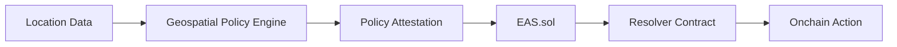
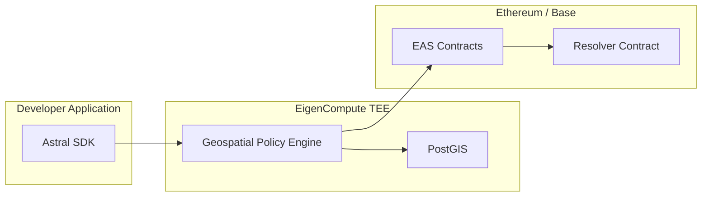

<Warning>
  **Research Preview** — Astral Location Services are under active development and not yet production-ready.
  APIs may change. We're building in public and welcome your feedback!
</Warning>

# What is Astral Location Services?

Astral Location Services is a **geospatial policy engine** that connects location-based logic to smart contracts on Ethereum. Think of it as a **geofencing oracle** for onchain applications.

We provide spatial operations (distance, containment, intersection) that run in a trusted execution environment and produce signed attestations you can use to trigger onchain actions.

<CardGroup cols={2}>
  <Card title="Geofencing" icon="map-location-dot">
    Check if locations are within boundaries, enable region-based logic and territorial restrictions
  </Card>
  <Card title="Location-Aware Smart Contracts" icon="location-crosshairs">
    Trigger onchain actions based on real-world proximity, distance, and spatial relationships
  </Card>
  <Card title="Proof-of-Visit" icon="stamp">
    Verify users visited specific locations and reward them with tokens, NFTs, or access rights
  </Card>
  <Card title="Spatial Policies" icon="shield-check">
    Create verifiable location-based rules that execute automatically through EAS resolvers
  </Card>
</CardGroup>

## The Core Flow



1. **Input**: Location records — EAS attestations or raw GeoJSON
2. **Processing**: Geospatial computations in a verifiable environment (TEE with PostGIS)
3. **Output**: Signed Policy Attestations submitted to EAS, triggering resolver contracts

## Quick Example

```typescript
import { AstralSDK } from '@decentralized-geo/astral-sdk';

const astral = new AstralSDK({
  chainId: 84532,
  signer: wallet,
  apiUrl: 'https://api.astral.global'
});

// Create a location attestation
const location = await astral.location.onchain.create({
  location: { type: 'Point', coordinates: [2.2951, 48.8580] }
});

// Check if user is within 500m of a landmark
const result = await astral.compute.within(
  location.uid,
  landmarkUID,
  500,  // meters
  { schema: RESOLVER_SCHEMA_UID, recipient: userAddress }
);

console.log(`Nearby: ${result.result}`);

// Submit onchain (developer pays gas, Astral is attester)
if (result.result) {
  await astral.compute.submit(result.delegatedAttestation);
}
```

## Why Astral?

### The Problem

Ethereum has no idea where things are happening. Smart contracts can't create location-aware logic or reason about real-world geography — they can't natively perform geospatial computations, verify location claims, or check spatial relationships like "is this point inside this boundary?" or "how far apart are these two locations?"

Without verifiable geocomputation, any location-based policy check can't be trusted onchain. Even if you have verified location data, an attacker could simply fabricate the computation results.

### The Solution

Astral solves this by providing:

1. **Verifiable Computation** — Spatial operations run in a TEE (trusted execution environment), producing cryptographically signed results
2. **Geospatial Policy Engine** — PostGIS-powered computations for distance, containment, intersection, and more
3. **EAS Integration** — Results are attestations that trigger resolver contracts for onchain actions

This introduces **location as a new onchain primitive** — enabling smart contracts to reason about geography for the first time.

<Info>
  **What about location verification?** GPS is spoofable, and verifying *where* a user actually is remains an open problem. We're developing the [Location Proof framework](https://collective.flashbots.net/t/towards-stronger-location-proofs/5323) to address this. Astral Location Services provide the geospatial policy layer that location proofs will plug into.
</Info>

## What You Can Build

<CardGroup cols={2}>
  <Card title="Local Currencies" icon="coins" href="/use-cases#local-currencies">
    Token swaps that only work if you're in the region
  </Card>
  <Card title="Proof-of-Visit NFTs" icon="ticket" href="/use-cases#proof-of-visit">
    Collectibles for visiting landmarks
  </Card>
  <Card title="Neighborhood DAOs" icon="users" href="/use-cases#neighborhood-daos">
    Governance tokens for local residents
  </Card>
  <Card title="Delivery Verification" icon="truck" href="/use-cases#delivery-verification">
    Escrow that releases when packages arrive
  </Card>
</CardGroup>

## The SDK

The Astral SDK provides a namespaced API for location attestations and geospatial computations:

```typescript
// Location attestations
astral.location.offchain.create(input);
astral.location.onchain.create(input);

// Geospatial computations
astral.compute.distance(from, to, options);
astral.compute.contains(container, containee, options);
astral.compute.within(geometry, target, radius, options);
astral.compute.submit(delegatedAttestation);
```

<Card title="SDK Reference" icon="code" href="/sdk/overview">
  Full SDK documentation
</Card>

## Architecture Overview



The Geospatial Policy Engine runs inside EigenCompute's TEE with PostGIS embedded, enabling verifiable computation. Policy Attestations are submitted to EAS contracts, which trigger your resolver contracts for onchain actions.

<Card title="Next: Quickstart" icon="rocket" href="/quickstart">
  Build your first location-gated smart contract
</Card>
