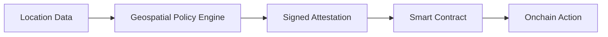

<Warning>
  **Development Preview** — Astral Location Services is under active development and not yet production-ready.
  APIs may change. We're building in public and welcome your feedback!
</Warning>

# What is Astral Location Services?

Astral Location Services is a **geospatial policy engine** that connects location-based logic to smart contracts on Ethereum.

We provide spatial operations (distance, containment, intersection) that run in a trusted execution environment and produce signed attestations you can use to trigger onchain actions.

<CardGroup cols={2}>
  <Card title="Verifiable Computation" icon="shield-check">
    Operations run in a TEE via EigenCompute, providing cryptographic proof that computations were performed correctly
  </Card>
  <Card title="EAS Native" icon="file-signature">
    Results are signed EAS attestations that work seamlessly with resolver contracts for onchain actions
  </Card>
  <Card title="PostGIS Powered" icon="globe">
    Industrial-strength spatial operations backed by PostGIS — the gold standard in geospatial databases
  </Card>
  <Card title="SDK First" icon="code">
    Clean, intuitive TypeScript SDK designed for developers building location-based dApps
  </Card>
</CardGroup>

## The Core Flow



1. **Input**: Location attestations (EAS format) or raw GeoJSON
2. **Processing**: Geospatial computations in a verifiable environment (TEE)
3. **Output**: Signed Policy Attestations usable offchain and onchain

## Quick Example

<Note>
  **Code snippets need testing** — Examples show the intended API. Verify against the actual implementation before use.
</Note>

```typescript
import { AstralClient } from '@decentralized-geo/astral-compute';

const astral = new AstralClient({ chainId: 84532 });

// Check if user is within 500m of a landmark
const result = await astral.compute.within({
  geometry: userLocationUID,
  target: landmarkUID,
  radius: 500,  // meters
  chainId: 84532,
  schema: RESOLVER_SCHEMA,
  recipient: userAddress
});

console.log(`Nearby: ${result.result}`);

// Submit onchain (developer pays gas, Astral is attester)
if (result.result) {
  const tx = await astral.eas.submitDelegated(result.delegatedAttestation);
}
```

## Why Astral?

### The Problem

Smart contracts can't natively perform geospatial computations. Even if you have location data, there's no way to check "is this point inside this polygon?" or "how far apart are these two locations?" in a way that produces verifiable results for onchain use.

### The Solution

Astral provides the **geospatial computation layer** — the middle piece of the puzzle:

- **Verifiable computation** — Operations run in a TEE, not a black box
- **Composable results** — Signed attestations that any contract can verify
- **Familiar patterns** — EAS resolvers make integration natural
- **Complement, don't replace** — Use Turf.js for UX, Astral for verification

<Info>
  **What about location verification?** GPS is spoofable, and verifying *where* a user actually is remains an open problem. We're developing the [Location Proof framework](https://collective.flashbots.net/t/towards-stronger-location-proofs/5323) to address this. Astral Location Services provides the geospatial policy layer that location proofs will plug into.
</Info>

## What You Can Build

<CardGroup cols={2}>
  <Card title="Local Currencies" icon="coins" href="/use-cases#local-currencies">
    Token swaps that only work if you're in the region
  </Card>
  <Card title="Proof-of-Visit NFTs" icon="ticket" href="/use-cases#proof-of-visit">
    Collectibles for visiting landmarks
  </Card>
  <Card title="Neighborhood DAOs" icon="users" href="/use-cases#neighborhood-daos">
    Governance tokens for local residents
  </Card>
  <Card title="Delivery Verification" icon="truck" href="/use-cases#delivery-verification">
    Escrow that releases when packages arrive
  </Card>
</CardGroup>

## Architecture Overview

```
Developer App → Astral SDK → Geospatial Policy Engine (TEE) → Policy Attestation
                                        ↓
                                 PostGIS (in-container)
```

The geospatial policy engine runs inside EigenCompute's TEE environment with PostGIS embedded in the container, enabling verifiable geospatial computation with no external dependencies.

<Card title="Next: Quickstart" icon="rocket" href="/quickstart">
  Build your first location-gated smart contract in 10 minutes
</Card>
