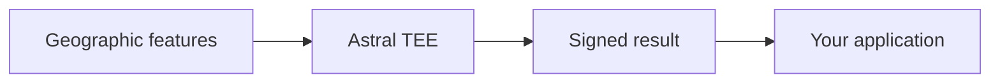

<Note>
  **Research preview** — Astral is under active development and not yet production-ready. APIs may change. We're building in public and welcome feedback.
</Note>

**Astral provides verifiable spatial computation.** Ask a spatial question — how far apart are these two points? Is this location inside that boundary? Do these regions overlap? — and get back a signed, verifiable answer.

The answer comes with cryptographic proof that it was computed correctly inside a Trusted Execution Environment. You can use it in an agent workflow, a backend service, a compliance report, or a smart contract. The result is the same regardless of where it ends up.

<CardGroup cols={2}>
  <Card title="Geocomputation" icon="calculator">
    Distance, containment, intersection, area, and length — computed with proof of correct execution
  </Card>
  <Card title="Location verification" icon="shield-check">
    Evidence-based verification of location claims using multi-factor location proofs
  </Card>
  <Card title="Agent integration" icon="robot">
    Use Astral as a spatial oracle in autonomous agent workflows
  </Card>
  <Card title="Blockchain integration" icon="link-simple">
    Submit signed results onchain as EAS attestations to trigger smart contract logic
  </Card>
</CardGroup>

## The core flow


```mermaid
graph LR
    A[Geographic features] --> B[Astral TEE]
    B --> C[Signed result]
    C --> D[Your application]
```

1. **Input**: Geographic features — points, polygons, lines, verified locations
2. **Compute**: Spatial operations execute inside a TEE with PostGIS
3. **Output**: A signed result you can verify independently

## Quick example

```bash
# How far is it from point A to point B?
curl -X POST https://api.astral.global/compute/distance \
  -H "Content-Type: application/json" \
  -d '{
    "from": { "type": "Point", "coordinates": [2.2945, 48.8584] },
    "to": { "type": "Point", "coordinates": [2.2951, 48.8580] },
    "chainId": 84532
  }'
```

The response includes the distance in meters, a cryptographic signature, and references to the inputs — everything needed to verify the result independently.

```typescript
import { AstralSDK } from '@decentralized-geo/astral-sdk';

const astral = new AstralSDK({
  chainId: 84532,
  apiUrl: 'https://api.astral.global'
});

const result = await astral.compute.distance({
  from: { type: 'Point', coordinates: [2.2945, 48.8584] },
  to: { type: 'Point', coordinates: [2.2951, 48.8580] },
  chainId: 84532
});

console.log(`Distance: ${result.result} meters`);
```

And if you want it onchain:

```typescript
// Submit as an EAS attestation
await astral.eas.submitDelegated(result.delegatedAttestation);
```

## Why verifiable spatial computation?

### The problem

Location data is untrusted everywhere. GPS is spoofable. Geocoding APIs are black boxes. When a delivery app says "the courier was within 100 meters," there's no way to independently verify that claim. The computation happened on someone's server, and you're taking their word for it.

### The solution

Astral makes spatial computation verifiable. The same PostGIS operations that power professional geospatial software — distance, containment, intersection — run inside a Trusted Execution Environment. The TEE signs each result with a key that only it holds. Anyone can verify the signature and confirm the computation was performed correctly on the stated inputs.

This matters for any application where spatial answers have consequences: insurance payouts, delivery escrow, geofence compliance, access control, autonomous agent decisions.

## What you can build

<CardGroup cols={2}>
  <Card title="Delivery verification" icon="truck">
    Escrow that releases when the courier arrives at the right location
  </Card>
  <Card title="Parametric insurance" icon="umbrella">
    Policies that trigger based on verified proximity to weather events
  </Card>
  <Card title="Geofence compliance" icon="map">
    Prove an asset stayed within an approved corridor
  </Card>
  <Card title="Location-gated smart contracts" icon="lock">
    Onchain actions triggered by verified spatial relationships
  </Card>
</CardGroup>

<Card title="Next: Quickstart" icon="rocket" href="/quickstart">
  Your first verified spatial computation in 5 minutes
</Card>
