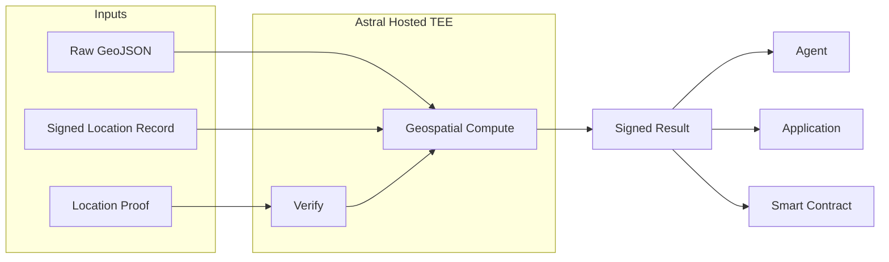

<Note>
  **Research Preview** — The Astral Protocol is under active development and not yet production-ready. APIs may change. We're building in public and welcome feedback.
</Note>

{/* TODO: John to handwrite opening 1-2 paragraphs. Draft below as a starting point — replace freely. */}

Location data is everywhere, but trust in location data is very brittle. GPS is spoofable. VPNs manipulate IP addresses. In most cases, location data can be edited freely or forged easily. When an agent, an application, or a smart contract needs to answer a spatial question — was this device actually there? Is this point inside that boundary? — there is no way to independently verify the claim or the computation. You're taking someone's word for it.

Location data is becoming more and more important across a range of use cases — so we built the Astral Protocol to introduce verifiable location-based services.

The system rests on two core capabilities:

<CardGroup cols={2}>
  <Card title="Location Proofs" icon="shield-check">
    Verify where a device, user, or event actually was — using multi-factor evidence from independent proof-of-location systems
  </Card>
  <Card title="Verifiable Geocomputation" icon="calculator">
    Ask spatial questions — distance, containment, intersection, area — and get back signed, cryptographically verifiable answers
  </Card>
</CardGroup>

Both produce **signed results** — cryptographic artifacts that any downstream system can verify independently. The result is the same whether it ends up in an autonomous agent's decision loop, a compliance report, a backend database, or a smart contract.

## Two Capabilities, One Pipeline


```mermaid
graph LR
    subgraph Inputs
        direction TB
        RG[Raw GeoJSON]
        SL[Signed Location Record]
        LP[Location Proof]
    end
    subgraph Astral Hosted TEE
        direction TB
        C[Geospatial Compute]
        V[Verify]
    end
    RG --> C
    SL --> C
    LP --> V
    V --> C
    C --> SR[Signed Result]
    SR --> A1[Agent]
    SR --> A2[Application]
    SR --> A3[Smart Contract]
```

1. **Collect + Compose** — Gather location evidence from various sources and compose it into a single, verifiable location proof.
2. **Verify** — Submit location proofs for evidence-based verification. The system evaluates stamps from independent proof-of-location systems and returns credibility scores.
3. **Compute** — Run spatial operations (distance, containment, intersection, area, length) inside a Trusted Execution Environment. PostGIS computes; the TEE signs.
4. **Use the results anywhere** — The signed results carry their own proof of correctness. Use them peer-to-peer, on centralized servers, or in smart contracts.

## Quick Example

Create a location proof, verify it, then check if the verified position is inside a geofence:

```typescript
import { AstralSDK, MockPlugin } from '@decentralized-geo/astral-sdk';

const astral = new AstralSDK({
  chainId: 84532,
  signer: wallet,
  apiUrl: 'https://staging-api.astral.global'
});

// 1. Register a proof-of-location plugin. The SDK ships MockPlugin for local
//    development; real device evidence comes from sources like the ProofMode app.
astral.plugins.register(new MockPlugin({ name: 'mock-1', lat: 37.7749, lon: -122.4194 }));

// 2. Collect signals, then create and sign a stamp
const signals = await astral.stamps.collect({ plugins: ['mock-1'] });
const unsigned = await astral.stamps.create({ plugin: 'mock-1' }, signals[0]);
const stamp = await astral.stamps.sign({ plugin: 'mock-1' }, unsigned, deviceSigner);

// 3. Compose a location proof: a claim ("I was here") bundled with evidence
const claim = {
  lpVersion: '0.2',
  locationType: 'geojson-point',
  location: { type: 'Point', coordinates: [-122.4194, 37.7749] },
  srs: 'http://www.opengis.net/def/crs/OGC/1.3/CRS84',
  subject: { scheme: 'eth-address', value: '0x1234...' },
  radius: 100,
  time: { start: Date.now() / 1000 - 60, end: Date.now() / 1000 },
};
const proof = astral.proofs.create(
  claim,
  [stamp] // multi-stamp location proofs are supported, and more secure
);

// 4. Verify against the hosted service. The result includes a credibility
//    vector — multidimensional, not a single score.
const verified = await astral.proofs.verify(proof, { mode: 'tee', chainId: 84532 });
console.log(verified.credibility);          // CredibilityVector — you decide how to weight it
const locationUID = verified.attestation.uid;

// 5. Compute — use the verified location in a spatial operation.
//    Compute arguments are positional; options carry the EAS schema UID.
const inside = await astral.compute.contains(
  geofencePolygon,   // container
  locationUID,       // containee
  { schema: SCHEMA_UID }
);
console.log(`Inside geofence: ${inside.result}`);
```

The response includes the computation result, a cryptographic signature from the TEE, and references to the inputs — everything needed to verify the answer independently.

The signed result is portable. Use it directly in your application:

```typescript
// In an agent workflow — branch on the verified spatial answer
if (inside.result) {
  confirmDelivery(inside);  // the signed result is the audit trail
}

// In a backend — store the signed result as evidence
await db.insert({ delivery_id, proof: inside });
```

Or submit it onchain to trigger smart contract logic:

```typescript
// Submit onchain via EAS — triggers your resolver contract
await astral.compute.submit({
  attestation: inside.attestation,
  delegatedAttestation: inside.delegatedAttestation,
});
```

## What You Can Build

Verified location data and verifiable spatial computation support applications that have, until now, depended on blind trust in self-reported location:

<CardGroup cols={2}>
  <Card title="Delivery Verification" icon="truck">
    Confirm a courier arrived at the right location — with evidence, not just GPS
  </Card>
  <Card title="Autonomous Agent Decisions" icon="robot">
    Give AI agents verifiable spatial reasoning with an auditable trail
  </Card>
  <Card title="Geofence Compliance" icon="map">
    Prove an asset stayed within an approved corridor
  </Card>
  <Card title="Parametric Insurance" icon="umbrella">
    Trigger policies based on verified proximity to events
  </Card>
  <Card title="Location-Gated Access" icon="lock">
    Gate features, content, or actions on verified presence
  </Card>
  <Card title="Onchain Spatial Logic" icon="link-simple">
    Submit signed results to smart contracts via EAS attestations
  </Card>
</CardGroup>

<Card title="Next: Quickstart" icon="rocket" href="/quickstart">
  Your first verified spatial computation in 5 minutes
</Card>
