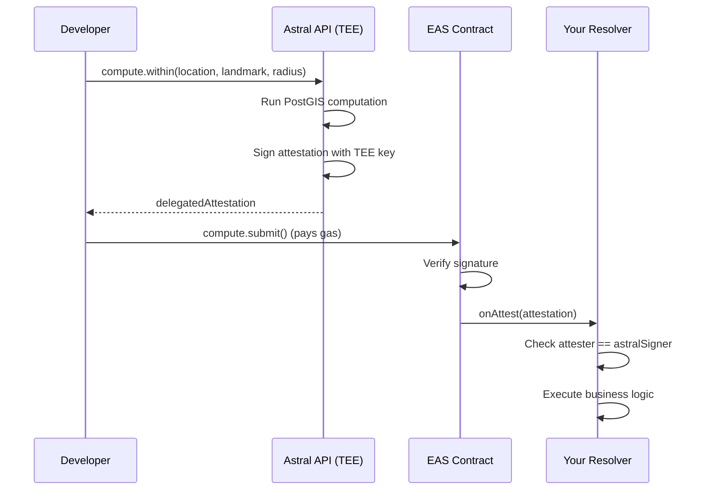

<Warning>
  **Research Preview** — The SDK is under development.
</Warning>

# EAS Integration

The Astral SDK integrates deeply with the Ethereum Attestation Service (EAS) for both location attestations and geospatial computation results.

## Overview

Astral uses EAS in two ways:

1. **Location Attestations**: Store location data as EAS attestations (offchain or onchain)
2. **Compute Results**: Store verified computation results via delegated attestations

---

## Delegated Attestations

The compute module uses the EAS delegated attestation pattern for submitting results onchain.

### How It Works



| Step | Who | Action |
|------|-----|--------|
| 1 | Developer | Calls `astral.compute.within()` or similar |
| 2 | Astral API | Runs computation in TEE, signs attestation |
| 3 | Developer | Receives `delegatedAttestation` |
| 4 | Developer | Calls `astral.compute.submit()` (pays gas) |
| 5 | EAS Contract | Verifies signature, records Astral as attester |
| 6 | Resolver | Verifies `attester == astralSigner`, executes logic |

---

## Submitting Delegated Attestations

### Basic Submission

```typescript
import { AstralSDK } from '@decentralized-geo/astral-sdk';

const astral = new AstralSDK({
  chainId: 84532,
  signer: wallet,
  apiUrl: 'https://api.astral.global'
});

// Compute a policy check
const result = await astral.compute.within(
  userLocationUID,
  landmarkUID,
  500,
  { schema: SCHEMA_UID, recipient: userAddress }
);

// Submit to EAS if check passed
if (result.result) {
  const submission = await astral.compute.submit(result.delegatedAttestation);
  console.log('Attestation UID:', submission.uid);
}
```

### Gas Estimation

```typescript
// Estimate gas before submitting
const gas = await astral.compute.estimate(result.delegatedAttestation);
console.log('Estimated gas:', gas.toString());

// Submit with confidence
if (gas < 300000n) {
  await astral.compute.submit(result.delegatedAttestation);
}
```

---

## Delegated Attestation Structure

The `delegatedAttestation` object contains everything needed for submission:

```typescript
interface DelegatedAttestation {
  message: {
    schema: string;         // EAS schema UID
    recipient: string;      // Attestation recipient
    expirationTime: bigint; // When attestation expires
    revocable: boolean;     // Whether can be revoked
    refUID: string;         // Reference UID (empty for new)
    data: string;           // Encoded attestation data
    value: bigint;          // ETH value (usually 0)
    nonce: bigint;          // Attester nonce
    deadline: bigint;       // Signature deadline
  };
  signature: {
    v: number;
    r: string;
    s: string;
  };
  attester: string;         // Astral signer address
}
```

---

## Signature Expiry

Delegated attestation signatures have a deadline. Check before submitting:

```typescript
const result = await astral.compute.within(uid1, uid2, 500, options);

// Check deadline
const deadline = result.delegatedAttestation.message.deadline;
const now = BigInt(Math.floor(Date.now() / 1000));

if (now < deadline) {
  // Signature still valid
  await astral.compute.submit(result.delegatedAttestation);
} else {
  // Signature expired - request new computation
  const newResult = await astral.compute.within(uid1, uid2, 500, options);
  await astral.compute.submit(newResult.delegatedAttestation);
}
```

---

## Verifying in Smart Contracts

Resolver contracts can verify attestations came from Astral:

```solidity
// SPDX-License-Identifier: MIT
pragma solidity ^0.8.0;

import "@eas/contracts/resolver/SchemaResolver.sol";

contract MyResolver is SchemaResolver {
    address public astralSigner;

    constructor(IEAS eas, address _astralSigner)
        SchemaResolver(eas)
    {
        astralSigner = _astralSigner;
    }

    function onAttest(
        Attestation calldata attestation,
        uint256 /*value*/
    ) internal override returns (bool) {
        // 1. Verify from Astral
        require(attestation.attester == astralSigner, "Not from Astral");

        // 2. Decode the result
        (
            bool result,
            bytes32[] memory inputRefs,
            uint64 timestamp,
            string memory operation
        ) = abi.decode(
            attestation.data,
            (bool, bytes32[], uint64, string)
        );

        // 3. Business logic
        if (result) {
            // Policy passed - execute action
        }

        return true;
    }

    function onRevoke(Attestation calldata, uint256)
        internal pure override returns (bool)
    {
        return false;
    }
}
```

---

## Location Attestation Schemas

Location attestations use a standard EAS schema:

```
uint256 eventTimestamp,string srs,string locationType,string location,string[] recipeType,string[] recipePayload,string[] mediaType,string[] mediaData,string memo
```

### Encoding/Decoding

```typescript
// Build unsigned attestation
const unsigned = await astral.location.build({
  location: { type: 'Point', coordinates: [lon, lat] },
  memo: 'My location'
});

// Encode for EAS
const encoded = astral.location.encode(unsigned);

// Decode from EAS data
const decoded = astral.location.decode(encodedData);
console.log(decoded.location);
console.log(decoded.memo);
```

---

## EAS Contract Addresses

The SDK automatically uses the correct EAS contract address based on `chainId`:

| Chain | Chain ID | EAS Contract |
|-------|----------|--------------|
| Base Sepolia | 84532 | `0x4200000000000000000000000000000000000021` |
| Base Mainnet | 8453 | `0x4200000000000000000000000000000000000021` |
| Ethereum Mainnet | 1 | `0xA1207F3BBa224E2c9c3c6D5aF63D0eb1582Ce587` |
| Ethereum Sepolia | 11155111 | `0xC2679fBD37d54388Ce493F1DB75320D236e1815e` |
| Celo | 42220 | `0x72E1d8ccf5299fb36fEfD8CC4394B8ef7e98Af92` |
| Arbitrum | 42161 | `0xbD75f629A22Dc1ceD33dDA0b68c546A1c035c458` |
| Optimism | 10 | `0x4200000000000000000000000000000000000021` |

---

## Offchain vs Onchain Attestations

### Offchain (EIP-712 Signed)

- No gas cost to create
- Stored off-chain (IPFS, your server, etc.)
- Verified by recovering signer from signature
- Use `astral.location.offchain.*`

```typescript
const attestation = await astral.location.offchain.create({
  location: geojson
});
// attestation.signature contains EIP-712 signature
// attestation.uid is derived from content hash
```

### Onchain (Blockchain Stored)

- Gas cost to create
- Stored in EAS contract
- Verified by querying blockchain
- Use `astral.location.onchain.*`

```typescript
const attestation = await astral.location.onchain.create({
  location: geojson
});
// attestation.txHash contains transaction hash
// attestation.uid is from EAS contract
```

---

## Custom Schemas

You can use custom EAS schemas for location attestations:

```typescript
const customSchema = {
  uid: '0x1234...abcd',  // Your schema UID
  rawString: 'uint256 eventTimestamp,string srs,string locationType,string location,string[] recipeType,string[] recipePayload,string[] mediaType,string[] mediaData,string memo'
};

// Use at initialization
const astral = new AstralSDK({
  chainId: 84532,
  signer: wallet,
  defaultSchema: customSchema
});

// Or per-operation
const attestation = await astral.location.offchain.create(
  { location: geojson },
  { schema: customSchema }
);
```

<Card title="Back: SDK Overview" icon="arrow-left" href="/sdk/overview">
  Return to SDK overview
</Card>
