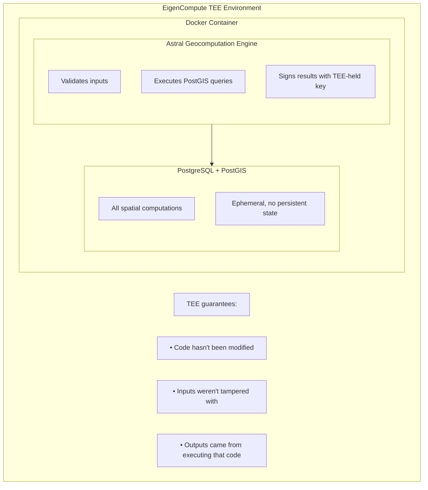
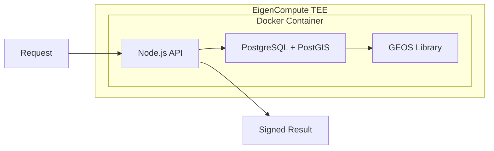

<Note>**Research Preview** — APIs may change. [GitHub](https://github.com/AstralProtocol)</Note>

# Architecture

Astral runs geocomputation inside a self-contained Docker container, designed to execute within a Trusted Execution Environment (TEE) via EigenCompute. This page describes how the system is built.

<Warning>
  **Deployment status.** Astral has run these services on real TEE hardware in test deployments, but does not currently fund continuous operation on attested hardware. The hosted staging service signs results with a key Astral controls; continuous remote attestation of the running enclave is target-state, not a live guarantee today. A valid signature today proves that a key Astral holds produced the result — not yet that an independently attested enclave did. See [What you are trusting](/trust-model/what-you-are-trusting) for the full accounting. If you want to evaluate Astral against real TEEs, reach out at [contact@astral.global](mailto:contact@astral.global).
</Warning>

## Execution model

## Container design

<AccordionGroup>
  <Accordion title="Self-contained container" icon="box">
    PostGIS runs **inside** the Docker container, not as an external service. This is essential for verifiable computation in the TEE — no external dependencies means the entire execution environment is attested.
  </Accordion>
  <Accordion title="Stateless model" icon="rotate">
    Each request brings all required inputs. No persistent state between requests. This ensures determinism and simplifies verification — same inputs always produce same outputs.
  </Accordion>
  <Accordion title="Signing key inside TEE" icon="key">
    The service holds a signing key that is generated within the TEE or securely provisioned. The design intent is that the operator cannot extract it — a property that holds when the enclave runs under remote attestation (see deployment status above). All signed results are produced with this key.
  </Accordion>
</AccordionGroup>

## Internal computation flow

<Info>
  PostGIS uses [GEOS](https://libgeos.org/) for geometry operations — the same C++ library used by QGIS, GDAL, and most professional geospatial software.
</Info>

## Why this architecture

The design choices above serve a single goal: making geocomputation results verifiable.

- **Self-contained** means the TEE attestation covers the entire execution environment. No external database calls that could be intercepted or altered.
- **Stateless** means determinism is straightforward. Given the same inputs, the container produces the same output every time.
- **Key inside TEE** means that, when the enclave runs under attestation, the signing key cannot be extracted or used outside it. If you trust the TEE — and the enclave is attested — you trust the signature. Today, a valid signature proves a key Astral controls produced the result; binding that key to a continuously attested enclave is target-state, not a live guarantee.

<Card title="Next: What is verified" icon="arrow-right" href="/trust-model/what-is-verified">
  What the signature covers and what computation reproducibility means
</Card>
