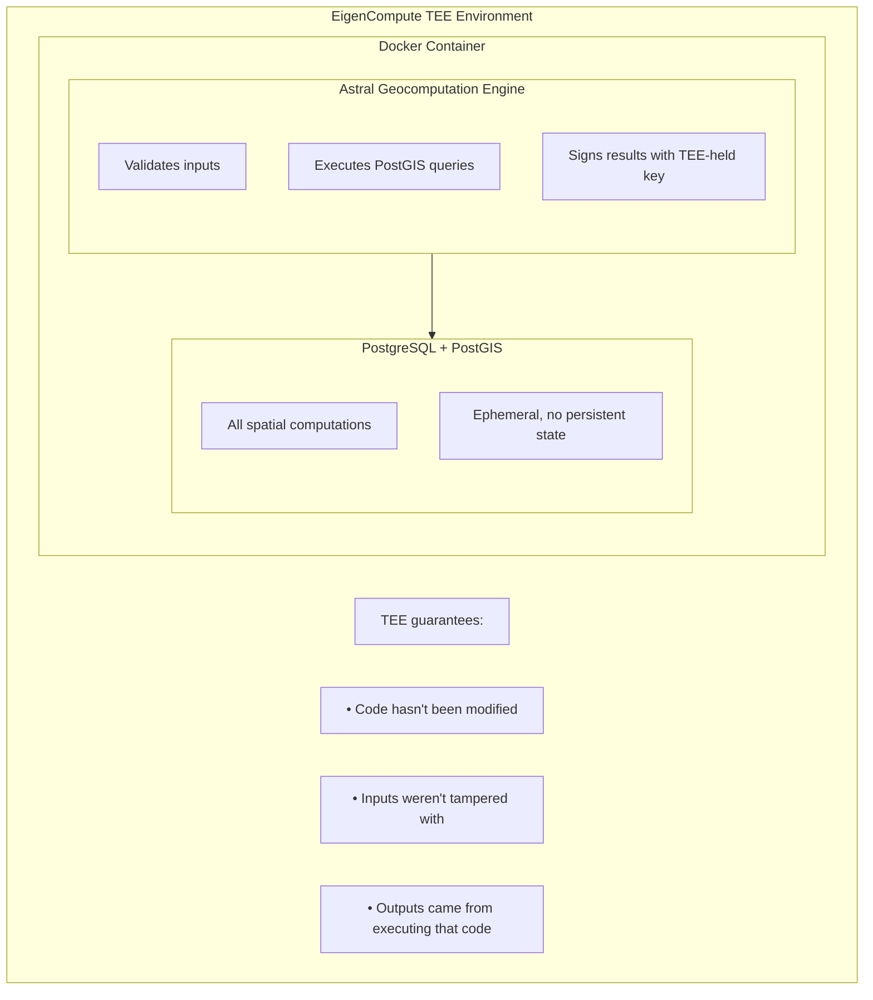
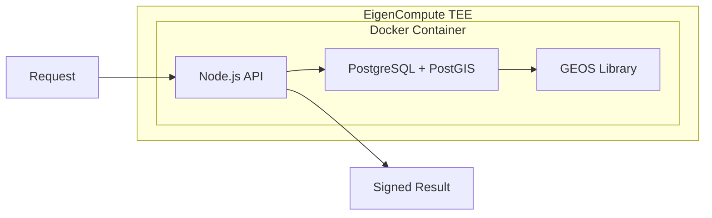

<Note>**Research Preview** — APIs may change. [GitHub](https://github.com/AstralProtocol)</Note>

# Architecture

Astral runs geocomputation inside a self-contained Docker container, executing within a Trusted Execution Environment (TEE) via EigenCompute. This page describes how the system is built.

## Execution model

## Container design

<AccordionGroup>
  <Accordion title="Self-contained container" icon="box">
    PostGIS runs **inside** the Docker container, not as an external service. This is essential for verifiable computation in the TEE — no external dependencies means the entire execution environment is attested.
  </Accordion>
  <Accordion title="Stateless model" icon="rotate">
    Each request brings all required inputs. No persistent state between requests. This ensures determinism and simplifies verification — same inputs always produce same outputs.
  </Accordion>
  <Accordion title="Signing key inside TEE" icon="key">
    The service holds a signing key that is generated within the TEE or securely provisioned. It cannot be extracted by the operator. All signed results are produced with this key.
  </Accordion>
</AccordionGroup>

## Internal computation flow

<Info>
  PostGIS uses [GEOS](https://libgeos.org/) for geometry operations — the same C++ library used by QGIS, GDAL, and most professional geospatial software.
</Info>

## Why this architecture

The design choices above serve a single goal: making geocomputation results verifiable.

- **Self-contained** means the TEE attestation covers the entire execution environment. No external database calls that could be intercepted or altered.
- **Stateless** means determinism is straightforward. Given the same inputs, the container produces the same output every time.
- **Key inside TEE** means the signing key cannot be extracted or used outside the attested environment. If you trust the TEE, you trust the signature.

<Card title="Next: What is verified" icon="arrow-right" href="/trust-model/what-is-verified">
  What the signature covers and what computation reproducibility means
</Card>
