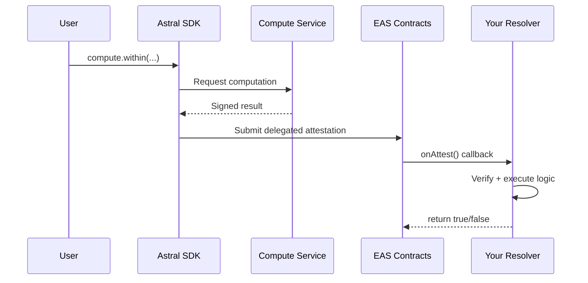

<Note>**Research preview** — APIs may change. [GitHub](https://github.com/AstralProtocol)</Note>

# Onchain attestation

This walkthrough covers the complete blockchain flow: register reference locations, compute a spatial relationship, submit the signed result as an EAS attestation, and let a resolver contract execute business logic.

The example builds an NFT that mints when the user is near a landmark — but the same pattern applies to any onchain action gated by spatial computation.

## The pattern



## Step 1: Register a reference location

Create an onchain location record for the landmark.

```typescript
import { AstralSDK } from '@decentralized-geo/astral-sdk';

const astral = new AstralSDK({ chainId: 84532, signer: wallet });

const landmark = await astral.location.onchain.create({
  location: { type: 'Point', coordinates: [-122.4194, 37.7749] },
  memo: "San Francisco Visitor Center"
});

console.log('Landmark UID:', landmark.uid);
```

## Step 2: Deploy a resolver contract

The resolver receives the signed result via EAS's `onAttest` callback and executes your business logic — in this case, minting an NFT.

```solidity
// SPDX-License-Identifier: MIT
pragma solidity ^0.8.0;

import "@eas/contracts/resolver/SchemaResolver.sol";
import "@openzeppelin/contracts/token/ERC721/ERC721.sol";
import "@openzeppelin/contracts/access/Ownable.sol";

contract LocationGatedNFT is SchemaResolver, ERC721, Ownable {
    address public astralSigner;
    bytes32 public landmarkUID;
    uint256 public nextTokenId = 1;

    mapping(address => bool) public hasMinted;
    mapping(bytes32 => bool) public usedAttestations;

    error NotFromAstral();
    error AlreadyUsed();
    error WrongOperation();
    error InvalidInputs();
    error WrongLocation();
    error AttestationTooOld();
    error NotCloseEnough();
    error AlreadyMinted();

    event NFTMinted(address indexed recipient, uint256 tokenId, bytes32 attestationUID);

    constructor(
        IEAS eas,
        address _astralSigner,
        bytes32 _landmarkUID
    )
        SchemaResolver(eas)
        ERC721("SF Visitor", "SFVISIT")
        Ownable(msg.sender)
    {
        astralSigner = _astralSigner;
        landmarkUID = _landmarkUID;
    }

    /// @dev Check if a string starts with a given prefix
    function _startsWith(string memory str, string memory prefix) internal pure returns (bool) {
        bytes memory strBytes = bytes(str);
        bytes memory prefixBytes = bytes(prefix);
        if (strBytes.length < prefixBytes.length) return false;
        for (uint256 i = 0; i < prefixBytes.length; i++) {
            if (strBytes[i] != prefixBytes[i]) return false;
        }
        return true;
    }

    function onAttest(
        Attestation calldata attestation,
        uint256 /*value*/
    ) internal override returns (bool) {
        // 1. Verify from Astral's TEE signer
        if (attestation.attester != astralSigner) revert NotFromAstral();

        // 2. Prevent replay
        if (usedAttestations[attestation.uid]) revert AlreadyUsed();
        usedAttestations[attestation.uid] = true;

        // 3. Decode signed result (boolean for 'within')
        (
            bool policyPassed,
            bytes32[] memory inputRefs,
            uint64 timestamp,
            string memory operation
        ) = abi.decode(
            attestation.data,
            (bool, bytes32[], uint64, string)
        );

        // 4. Verify correct operation
        if (!_startsWith(operation, "within")) revert WrongOperation();

        // 5. Verify correct landmark was checked
        if (inputRefs.length < 2) revert InvalidInputs();
        if (inputRefs[1] != landmarkUID) revert WrongLocation();

        // 6. Verify timestamp is recent (within 1 hour)
        if (timestamp < block.timestamp - 1 hours) revert AttestationTooOld();

        // 7. Verify user is within radius
        if (!policyPassed) revert NotCloseEnough();

        // 8. One mint per address
        if (hasMinted[attestation.recipient]) revert AlreadyMinted();
        hasMinted[attestation.recipient] = true;

        // 9. Mint NFT
        uint256 tokenId = nextTokenId++;
        _mint(attestation.recipient, tokenId);

        emit NFTMinted(attestation.recipient, tokenId, attestation.uid);
        return true;
    }

    function onRevoke(Attestation calldata, uint256)
        internal pure override returns (bool)
    {
        return false;
    }

    function updateAstralSigner(address _signer) external onlyOwner {
        astralSigner = _signer;
    }
}
```

## Step 3: Register the schema

Register an EAS schema that points to your resolver contract.

```typescript
import { SchemaRegistry } from '@ethereum-attestation-service/eas-sdk';

const schemaRegistry = new SchemaRegistry(SCHEMA_REGISTRY_ADDRESS);

// Boolean result schema for 'within' operation
const schema = "bool result,bytes32[] inputRefs,uint64 timestamp,string operation";

const tx = await schemaRegistry.connect(signer).register({
  schema,
  resolverAddress: nftContract.address,
  revocable: true  // Must be true — Astral signs with revocable=true
});

const receipt = await tx.wait();
const SCHEMA_UID = receipt.logs[0].args.uid;
```

<Warning>
  **Schema must use `revocable: true`** — Astral signs delegated attestations with `revocable: true`. If your schema is registered with `revocable: false`, EAS will reject the attestation.
</Warning>

## Step 4: Compute and submit

The user's app gets their location, computes proximity, and submits the signed result onchain.

```typescript
async function mintNFT(userCoords: [number, number], wallet: Signer) {
  const astral = new AstralSDK({ chainId: 84532, signer: wallet });

  // Create user's location record
  const userLocation = await astral.location.onchain.create({
    location: { type: 'Point', coordinates: userCoords }
  });

  // Compute proximity — returns signed result
  const result = await astral.compute.within(
    userLocation.uid,
    LANDMARK_UID,
    500,  // 500 meter radius
    {
      schema: SCHEMA_UID,
      recipient: await wallet.getAddress()
    }
  );

  if (!result.result) {
    throw new Error('Not close enough to the landmark');
  }

  // Submit to EAS — triggers resolver, mints NFT
  const tx = await astral.eas.submitDelegated(result.delegatedAttestation);
  const receipt = await tx.wait();

  return {
    transactionHash: tx.hash,
    attestationUID: result.attestation.uid
  };
}
```

## Other resolver patterns

The same flow works for any onchain action. Swap the resolver logic to fit your use case:

**Token distribution** — airdrop tokens to users who prove they visited a location:

```solidity
function _executeAction(address recipient) internal override {
    token.transfer(recipient, amount);
}
```

**Access control** — grant onchain permissions based on spatial verification:

```solidity
function _executeAction(address recipient) internal override {
    hasAccess[recipient] = true;
}
```

**Geofenced transfers** — restrict token transfers to users within a region (see the [geofenced token guide](/guides/geofenced-token) for the full implementation).

For more resolver patterns, decoding signed results, and blockchain integration details, see [Blockchain integration](/guides/blockchain-integration).

<Card title="Next: Blockchain integration" icon="book" href="/guides/blockchain-integration">
  Deep dive into resolver patterns and chain configuration
</Card>
